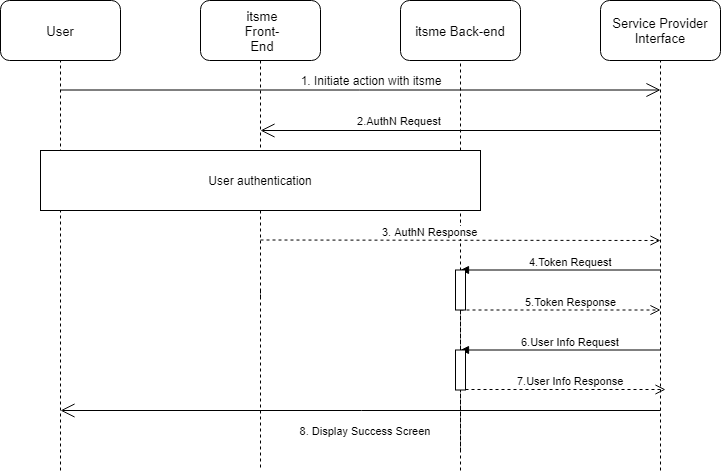
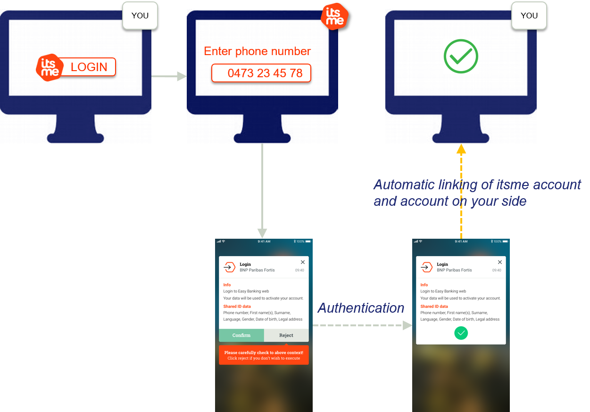
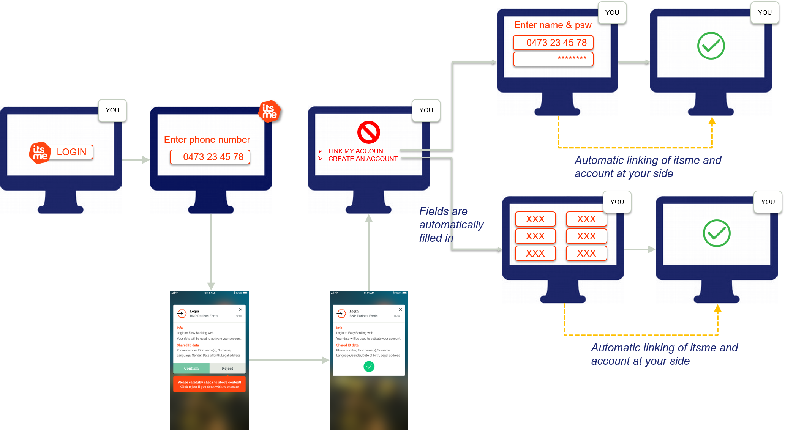

# 1. Introduction
itsme® is an identity checking system allowing Service Providers to use verified identities – through 4 services – for authentication and authorization on their web desktop, mobile web and in-app mobile applications:
<ul>
  <li>Login</li>
  <li>Confirm</li>
  <li>Share Data</li>
  <li>Sign</li>
</ul>

The objective of this document is to provide all the information needed to integrate the Login and Share Data services using the <a href="http://openid.net/specs/openid-connect-core-1_0.html" target="blank">OpenID Connect Core 1.0 specifications</a>.

  
<a name="Onboarding"></a>
# 2. Creating sandbox
 
Before your application can use itsme® OpenID Login and Share Data services, you must set up a project in the <a href="https://brand.belgianmobileid.be/d/CX5YsAKEmVI7" target="blank">itsme® B2B portal</a> to obtain credentials (`client_id`, ServiceCode, JWKSet URL and associated certificates,...), set a redirect URI, and customize the branding information that the Users see on the user-consent screen (e.g.: WYSIWYS screen) in the itsme® app. 

<aside class="notice">When creating your sandbox, you have to provide us one JWKSet URL and the associated certificate. It will be used by our Back-End for the decryption and signature verification of the JWTokens present in the OpenID Connect flow. Following requirements MUST be met:
<ul>
 <li>Only one JWKSet URL MUST be specified.</li>
 <li>The JWKSet URL certificate MUST contain the root, the intermediate Certificate Authority and the final public certifiate.</li>
 <li>On the HTTPS protocol level, connections MUST be secured using trusted Root CA.</li>
 <li>A self-signed certificate MAY be used (it MUST NOT be self-signed in production)</li>
 <li>Belgian Mobile ID MUST be notified on time if the certificate or the URL is changed.</li>
 <li>There is no need for your client certificate. Currently the certificate is also used to protect the JWKSet and it is not directly linked to the SSL certificate.</li>
</li>
</aside>

<aside class="warning">If not explicitely set, a default JWKSet will be used during Sandbox creation. The public keys are exposed on <a href="https://belgianmobileid.github.io/slate/jwks.json" target="blank">https://belgianmobileid.github.io/slate/jwks.json</a> while the corresponding private keys are exposed on <a href="https://belgianmobileid.github.io/slate/jwks.json" target="blank">https://belgianmobileid.github.io/slate/private_jwks.json</a>.
</aside>

<aside class="notice">You can find our JWKSet URL in the itsme® <a href="https://openid.net/specs/openid-connect-discovery-1_0.html" target="blank">OpenID configuration file</a>, using the key <code>jwks_uri</code>.
</aside>

<aside class="notice">Redirect URIs (to which the User will be redirected after authentication in the itsme App) need to be whitelisted by our Back-End.
<ul>
  <li>Additional URL parameters are not allowed and entire redirect_uri MUST match the one provided in the B2B portal.</li>
  <li>Only one redirect_uri MUST be specified for each service.</li>
  <li>Belgian Mobile ID MUST be notified on time if the URLs are changed.</li>
</ul>
</aside>


# 3. Integrating itsme services

The itsme® Login and Share Data service integration is based on the <a href="http://openid.net/specs/openid-connect-core-1_0.html#CodeFlowAuth" target="blank">Authorization Code Flow</a> of OpenID Connect 1.0. The Authorization Code Flow goes through the steps as defined in <a href="http://openid.net/specs/openid-connect-core-1_0.html#CodeFlowSteps" target="blank">OpenID Connect Core Authorization Code Flow Steps</a>, depicted in the following diagram
  
 
 
<ol>
  <li>The user indicates on your end he wishes to authenticate with itsme</li>
  <li>Your web desktop, mobile web or in-app mobile application (e.g.: The Relying Party) sends a request to itsme® (e.g.: OpenID Provider) to authenticate the User. This request will redirect the user to our Front-End.
  itsme® then authenticates the User by asking him
    <ul type>
      <li>to enter his MSISDN on the itsme® OpenID web page</li>
      <li>authorize the release of some information’s to your application</li>
      <li>to provide his credentials (itsme® code or fingerprint or FaceID)</li>
    </ul>
  
  If you are building a mobile web or in-app mobile application, the User don’t need to enter his MSISDN on the itsme® OpenID web page, he will be automatically redirected to the itsme app via the Universal links and App links.</li>
  <li>Once the User has has authorized the request and has been authenticated the request itsme® will return an Authorization Code to your server component.</li>
  <li>Your server component contacts the Token Endpoint and exchanges the Authorization Code for an ID Token identifying the User and an Access Token, redirecting the user to your mobile or web application.</li>
  <li>You may request the additional user information from the userInfo Endpoint by presenting the Access Token obtained in the previous step.</li>
  <li>At this stage you are able to confirm the success of the operation and display a success error message.</li>
</ol>

This flow is described in much more detail in the following sections.
 

## 3.1. Checking itsme® OpenID Configuration

To simplify implementations and increase flexibility, <a href="https://openid.net/specs/openid-connect-discovery-1_0.html" target="blank">OpenID Connect allows the use of a Discovery Document</a>, a JSON document containing key-value pairs which provide details about itsme® system configuration, such as 
<ul>
  <li>URIs of the authorization</li>
  <li>token</li>
  <li>UserInfo</li>
  <li>supported claims</li>
  <li>JWKSet URL</li>
</ul>

The sandox Discovery Document for itsme® services may be retrieved from:[https://e2emerchant.itsme.be/oidc/.well-known/openid-configuration](https://e2emerchant.itsme.be/oidc/.well-known/openid-configuration).

<aside class="notice">The key-value pairs that MUST be used to integrate itsme® in production can be redeemed from <a href="https://merchant.itsme.be/oidc/.well-known/openid-configuration" target="blank">https://merchant.itsme.be/oidc/.well-known/openid-configuration</a>.
</aside>


<a name="AuthNRequest"></a>
## 3.2. Forming an authentication request

First, you will form a HTTPS GET request that MUST be sent to the itsme® Authorization Endpoint. The itsme® Authorization Endpoint is `https://e2emerchant.itsme.be/oidc/authorize`. This URI can be retrieved from the itsme® <a href="https://e2emerchant.itsme.be/oidc/.well-known/openid-configuration" target="blank">Discovery document</a>, using the key `authorization_endpoint`.

<aside class="notice">We strongly recommend to use only the HTTP `GET` method, since `POST` method will not be authorized when triggering the itsme App through the Universal Link mechanism (more informations about Universal links and App links can be found in <a href="#UniversalLinks">section 3.4</a>.</aside>

The OpenID Connect Core Specification defines a number of mandatory and recommended parameters to integrate in the HTTPS GET query string:

```http--inline
 GET /authorize?response_type=code HTTP/1.1
 &scope=openid%20profile%20email%20service%3Aclient.registration
 &client_id=s6BhdRkqt3
 &state=af0ifjsldkj
 &redirect_uri=https%3A%2F%2Fclient.example.org%2Fcb HTTP/1.1
 Host: server.itsme.be
 ```

Parameter | Required | Description
:-------- | :--------| :----- 
**client_id** | Required |This MUST be the client identifier (e.g. : PartnerCode) you received when registering your application in the [itsme® B2B portal](#Onboarding).
**response_type** | Required | This defines the processing flow to be used when forming the response. Because itsme® uses the Authorization Code Flow as described above, this value MUST be `code`.
**scope** | Required | The scope parameter allows the application to express the desired scope of the access request. It MUST contain the value `openid` and `service: service_code`, the itsme® service you want to use as defined for your application in the [itsme® B2B portal](#Onboarding). <br>The `openid` scope can return standard User attributes (these claims are:`iss`, `aud`, `exp`, `iat` and `at_hash`) in the `id_token` and/or in the response from the userInfo Endpoint.</br><br>Applications can ask for additional scopes, separated by spaces, to request more information about the User. The following additional scopes apply:<ul><li>profile: will request the claims representing basic profile information. These are `family_name`, `given_name`, `gender`, `birthdate` and `locale`.</li><li>email: will request the `email` and `email_verified` claims.</li></ul>For more information on User attributes or claims, please consult the [ID claims](#Data) section.</br><br>An HTTP ERROR `not_implemented` will be returned if the required values are not specified.</br><br>Unrecognised values will be ignored.</br><br>Note: you'll need to define one scope for each itsme® service you want to use.</br>
**redirect_uri** | Required | This is the URI to which the authentication response should be sent. This must exactly match one of the redirection URIs defined when registering your application in the [itsme® B2B portal](#Onboarding).
**state** | An appropriate value is strongly RECOMMENDED | It is recommended that you use this parameter to maintain state between the request and the callback. Typically, Cross-Site Request Forgery (CSRF, XSRF) mitigation is done by cryptographically binding the value of this parameter with a browser cookie.
**nonce** | An appropriate value is strongly RECOMMENDED | String value used to associate a session with an ID Token, and to mitigate replay attacks. The value is passed through unmodified from the authentication request to the ID Token. Sufficient entropy MUST be present in the `nonce` values used to prevent attackers from guessing values. See <a href="http://openid.net/specs/openid-connect-core-1_0.html#NonceNotes" target="blank">OpenID Connect Core specifications</a> for more information.
**login_hint** | Optional | Hint to the Authorization Server about the login identifier the User might use to log in (if necessary).<br>If provided, this value MUST be a phone number in the format specified for the `phone_number` claim: `<countrycode>+<phonenumber>`. E.g. `login_hint=32+123456789`.</br><br>`login_hint` with invalid syntax will be ignored.</br>
**display** | Optional | ASCII string value that specifies how the Authorization Server displays the authentication and consent User interface pages to the User. MUST be `page` if provided.<br>Other values will yield an HTTP ERROR `not_implemented`.</br>
**prompt** | Optional | Space delimited, case sensitive list of ASCII string values that specifies whether the Authorization Server prompts the User for reauthentication and consent. MUST be `consent` if provided. 
**ui_locales** | Optional | User's preferred languages and scripts for the User interface (e.g.: OpenID web page). Supported values are: {“fr”, “nl”, “en”, “de”}. Any other value will be ignored.
**max_age** | Optional | Specifies the allowable elapsed time in seconds since the last time the User was actively authenticated by itsme®. If the elapsed time is greater than this value, the authentication system MUST attempt to actively re-authenticate the User. As itsme® does not maintain a session mechanism, an active authentication is always required.
<a name="acrvalues">**acr_values**</a> | Optional | Space-separated string that specifies the acr values that the Authorization Server is being requested to use for processing this Authentication Request, with the values appearing in order of preference.<br>2 values are supported:<ul><li>Basic level - let the User to choose either fingerprint usage (if device is compatible) or PIN<br>`tag:itsmetag:sixdots.be,2016-06:acr_basic`</br></li><li>Advanced level - force the User to use PIN<br>`tag:itsmetag:sixdots.be,2016-06:acr_advanced`</br></li></ul>When multiple values are provided only the most constraining will be used (advanced > basic). If not provided basic level will be used.</br>
**claims** | Optional | This parameter is used to request that specific claims be returned. The value is a JSON object listing the requested claims.<br>Usage of claims parameter in the request object is recommended over this parameter as it will be signed in the JWT token, and the returned data will be encrypted.</br><br>See [User Data](#Data) for more information.</br>
**request** | Optional | This parameter enables OpenID Connect requests to be passed in a single, self-contained parameter and to be optionally signed and/or encrypted. The parameter value is a Request Object value.<br>See <a href="https://openid.net/specs/openid-connect-core-1_0.html" target="blank">OpenID Connect Core specifications</a> for more information.</br>
**response_mode** | Not supported | Any supplied value will be ignored.
**id\_token\_hint** | Not supported | Any supplied value will be ignored.
**claims_locales** | Not supported | Any supplied value will be ignored.
**request_uri** | Not supported | Any supplied value will be ignored.
**registration** | Not supported | Any supplied value will be ignored.

<a name="AuthNResponse"></a>
## 3.3. Capturing an Authorization Code

### Capturing a successful Authorisation Code

If the User is successfully authenticated and authorizes access to the data requested, itsme® will return an authorisation code to your server component. This is achieved by returning an Authentication Response, which is a HTTP 302 redirect request to the `redirect_uri` specified previously in the authentication request.
 
```http--inline
HTTP/1.1 302 Found
Location: https://client.example.org/cb?
code=SplxlOBeZQQYbYS6WxSbIA&
state=af0ifjsldkj
 ```
The response will contain:

Values | Returned | Description
:--:|:------ |:--
**code** | Always |The code parameter holds the Authorization Code which is a string value. The content of Authorization Code is opaque for you. This code has a lifetime of 3 minutes.
**state** | If provided |The state parameter will be returned if you provided a value in the Authentication request. You should validate that the value returned matches the one supplied in the authentication request. The state value can additionally be used to mitigate against XSRF attacks by cryptographically binding the value of this parameter with a browser cookie.
 
### Handling Authentication Error Response

If the request fails due to a missing, invalid, or mismatching redirection URI, or if the client identifier is missing or invalid, the Authorization Server SHOULD inform the User of the error and MUST NOT automatically redirect him to the invalid redirection URI. 

If the User denies the authentication request or if the request fails for reasons other than a missing or invalid redirection URI, itsme® will return an error response to your application. As for a successful response this is achieved by returning a HTTPS 302 redirect request to the redirection_uri specified in the authentication request. Following parameters could be added to the query component of the redirection_uri:


```http--inline
HTTP/1.1 302 Found
Location: https://client.example.org/cb?
error=invalid_request
&error_description=Unsupported%20response_type%20value
&state=af0ifjsldkj 
```

Values |	Returned | Description
:--|:--|:--
**error**	| Always |	Error type. 
**error_description** |	Always	| Indicating the nature of the error

The following table describes the various error codes that can be returned in the `error` parameter of the error response:

Error | Description
:-- | :-- 
**interaction_required**  | The Authorization Server requires User interaction of some form to proceed.
**invalid_request_object** | The `request` parameter contains an invalid Request Object.
**request_uri_not_supported** | This error is returned because itsme® does not support use of the `request_uri` parameter defined in the JWTs.
**registration_not_supported** | This error is returned because itsme® does not support use of the `registration` parameter.

All other HTTPS errors unrelated to OpenID Connect Core will be returned to the User using the appropriate HTTPS status code.

<a name="UniversalLinks"></a> 
## 3.4. Supporting Universal Links and App Links mechanism
<a href="https://developer.apple.com/ios/universal-links/" target="blank">Universal links</a> and <a href="https://developer.android.com/studio/write/app-link-indexing" target="blank">App links</a> are standard web links (http://mydomain.com) that point to both a web page and a piece of content inside an app. When a Universal Link is opened, the app OS checks to see if any installed app is registered for that domain. If so, the app is launched immediately without ever loading the web page. If not, the web URL is loaded into the webbrowser.

An App link is the Android version of the Universal link.

How do Universal Links work in iOS and Android ? Before Universal Links, the primary mechanism to open up an app when it was installed was by trying to redirect to an app’s URI scheme  in the web browser. But there was no way to check if the app was installed or not. This meant that developers would try to call the URI scheme 100% of the time, in the off chance that the app was installed, then fallback gracefully to the App Store or Google Play Store when not by using a timer.

iOS Universal Links and Android App Links were intended to fix this. Instead of opening up the web browser first when a link is clicked, the OS will check if a Universal Link has been registered (a file should be there in the domain which contains the bundle id of the app and the paths the app should open) for the domain associated with the link, then check if the corresponding app is installed. If the app is currently installed, it will be opened. If it’s not, the web browser will open and the HTTPS link will load.

Functionally, it will allow you to have a single link that will either open your desktop web application, your mobile app or your mobile site on the User’s device.

The specifications for the implementation of Universal links and App links can be found in the [Appendix](#Appendix).

## 3.5. Exchanging the authorisation code 
<a name="tokenEndpoint"></a> 
Once your server component has received an [Authorization Code](#AuthNResponse), your server can exchange it for an Access Token and an ID Token.

<aside class="notice">You might also read in the OpenID Connect Core specification about the Refresh Token, but we don't support them (we don't implement any session mechanism).</aside>

Your server makes this exchange by sending an HTTPS POST request to the itsme® Token Endpoint URI `https://e2emerchant.itsme.be/oidc/token`. This URI can be retrieved from the itsme® <a href="https://e2emerchant.itsme.be/oidc/.well-known/openid-configuration" target="blank">Discovery document</a> using the key `token_endpoint`.

<aside class="notice"> An Authorization Code can only be exchanged once. Attempting to re-exchange a code will generate a bad request response, outlined below in the section Handling token error response. </aside>

The request MUST include the following parameters in the `POST` body:

```http--inline
GET /oidc/authorization HTTP/1.1
?response_type=code
&client_id=yourpartnercode
&redirect_uri=yourredirecturl
&scope=openid+service%3Ayourservicecode+profile
&claims={
  "userinfo":
  {
    " tag:sixdots.be,2016-06:claim_nationality": null
  },
  "id_token":
  {
    "auth_time":
    {
      "essential": true
    },
    "acr_values":
    {
      "value":["tag:sixdots.be,2016-06:acr_advanced"]
    }
  }
}
&state=anystate
&nonce=anonce
&prompt=login
&max_age=1
```
Parameter | Required | Description
:-- | :-- | :--
**grant_type** | Required | This MUST be set to `authorization_code`.
**code** | Required | The Authorization Code received in response to the Authentication Request.
**redirect_uri** | Required | The redirection URI supplied in the original Authentication Request. This is the URL to which you want the User to be redirected after the authorization is complete.
**client_assertion** | Required | To ensure that the request is genuine and that the tokens are not returned to a third party, you will be authenticated when making the token request.<br>The OpenID Connect Core Specification support multiple authentication methods, but itsme® only supports `private_key_jwt`. This authentication method uses a JWT signed with a public key you have registered. The JWT MUST be sent as the value of a client_assertion parameter.</br><br>See <a href="http://openid.net/specs/openid-connect-core-1_0.html#ClientAuthentication" target="blank">section 9</a> of the OpenID Connect Core specification for more information.</br>
**client\_assertion\_type** | Required | This MUST be set to `urn:ietf:params:oauth:client-assertion-type:jwt-bearer`. 

According to the `private_key_jwt` client authentication method, the `client_assertion` JWT must contain the following parameters:

Parameter | Description
:-- | :-- 
**iss** | The issuer of the `private_key_jwt`. This MUST contain the `client_id`. This is the client identifier (e.g. : PartnerCode) you received when registering your application in the [itsme® B2B portal](#Onboarding).
**sub** | The subject of the `private_key_jwt`. This MUST contain the `client_id`. This is the client identifier (e.g. : PartnerCode) you received when registering your application in the [itsme® B2B portal](#Onboarding).
**aud** | Value that identifies the Authorization Server as an intended audience. This MUST be the itsme® Token Endpoint URL : `https://e2emerchant.itsme.be/oidc/token`
**jti** | A unique identifier for the token, which can be used to prevent reuse of the token. These tokens MUST only be used once.
**exp** | Expiration time on or after which the ID Token MUST NOT be accepted for processing.

<a name="TokenResponse"></a>
## 3.6. Managing Token Response

### Extracting a successful Token response

If the token request has been sucessfully validated we will return an HTTP 200 OK response including ID and Access Tokens as in the example aside:

```http--inline
HTTP/1.1 200 OK
Content-Type: application/json
Cache-Control: no-store
Pragma: no-cache
{
  "access_token": "SlAV32hkKG",
  "token_type": "Bearer",
  "expires_in": 3600,
  "id_token": "eyJhbGciOiJSUzI1NiIsImtpZCI6IjFlOWdkazcifQ.ewogImlzc
  yI6ICJodHRwOi8vc2VydmVyLmV4YW1wbGUuY29tIiwKICJzdWIiOiAiMjQ4Mjg5
  NzYxMDAxIiwKICJhdWQiOiAiczZCaGRSa3F0MyIsCiAibm9uY2UiOiAibi0wUzZ
  fV3pBMk1qIiwKICJleHAiOiAxMzExMjgxOTcwLAogImlhdCI6IDEzMTEyODA5Nz
  AKfQ.ggW8hZ1EuVLuxNuuIJKX_V8a_OMXzR0EHR9R6jgdqrOOF4daGU96Sr_P6q
  Jp6IcmD3HP99Obi1PRs-cwh3LO-p146waJ8IhehcwL7F09JdijmBqkvPeB2T9CJ
  NqeGpe-gccMg4vfKjkM8FcGvnzZUN4_KSP0aAp1tOJ1zZwgjxqGByKHiOtX7Tpd
  QyHE5lcMiKPXfEIQILVq0pc_E2DzL7emopWoaoZTF_m0_N0YzFC6g6EJbOEoRoS
  K5hoDalrcvRYLSrQAZZKflyuVCyixEoV9GfNQC3_osjzw2PAithfubEEBLuVVk4
  XUVrWOLrLl0nx7RkKU8NXNHq-rvKMzqg"
}
```
The response body will include the following parameters:

Values | Returned | Description
:-- | :-- | :--
**`access_token`** | Always | The Access Token which may be used to access the userInfo Endpoint.
**`token_type`** | Always | Set to `Bearer`.
**`id_token`** | Always | The Base64URL encoded ID Token corresponding to the Authentication Request.
**`at_hash`** | Not supported | itsme® does not provide any value for this parameter.
**`refresh_token`** | Not supported | itsme® does not provide any value for this parameter as it only maintains short-lived session to enforce re-authentication.

The `id_token` parameter is comprised of three Base64URL encoded elements. The first element is the ID Token header. If you decode the value you should get a string similar to the one below:

`{"alg":"RS256","kid":"1e9gdk7"}`

This specifies that the token has been signed with an RSA Signature utilising the SHA-256 hashing algorithm and the key identified by the string “1e9gdk7”. 

Decoding the second element gives you the JSON object containing the claims about the User. Following fields could be returned: For example decoding the value from the example above gives:

Values |	Returned |	Description
:-- | :-- | :--
**iss**	| Always | Identifier of the issuer of the ID Token.
**sub** |	Always | An identifier for the User, unique among all itsme® accounts and never reused. Use <code>sub</code> in the application as the unique-identifier key for the User.
**aud**	| Always |	Audience of the ID Token. This will contain the <code>client_id</code>. This is the client identifier (e.g. : PartnerCode) you received when registering your application in the [itsme® B2B portal](#Onboarding).
**exp**	| Always |	Expiration time on or after which the ID Token MUST NOT be accepted for processing.
**iat** |	Always	| The time the ID Token was issued, represented in Unix time (integer seconds).
**auth_time** | Always | The time the User authentication occurred, represented in Unix time (integer seconds). 
**nonce** | If provided | String value used to associate a session with an ID Token, and to mitigate replay attacks. The value is passed through unmodified from the Authentication request to the ID Token. Sufficient entropy MUST be present in the <code>nonce</code> values used to prevent attackers from guessing values. See <a href="http://openid.net/specs/openid-connect-core-1_0.html#NonceNotes" target="blank">the OpenID Connect Core specifications</a> for more information.
**acr** | Always | Possible values: `tag:sixdots.be,2016-06:acr_basic` and `tag:sixdots.be,2016-06:acr_advanced`
**amr** | Never |
**azp** | Never |

The third element is the signature over the JSON object. Details on how this signature is created and on how to validate it can be found in the <a href="https://tools.ietf.org/html/rfc7515" target="blank">JSON Web Signature specification</a>.

In short, this Base64URL encoding is called a JSON Web Token (JWT). It makes sure that the data you received has not been modified. 

### Handling token error response 

If the token request is invalid or unauthorized an HTTP 400 response will be returned as in the example:

```http--inline
HTTP/1.1 400 Bad Request
Content-Type: application/json
Cache-Control: no-store
Pragma: no-cache
{
  "error": "invalid_request"
}
```

The response will contain an error parameter and optionally `error_description` and `error_uri` parameters. The `error_uri` parameter may be used by implementations to specify a human-readable web page with information about the error, used to provide the client developer with additional information about the error.

## 3.7. Identifying the User

After obtaining the User ID Token, you should query your database to check if you know the `sub`, or not. If you already linked this `sub` to an account in your database, you should start an application session for that User.

If the `sub` returned in the ID Token is unknown to you, one of the following scenarios should be implemented to link the userCode to the correct User account:

<ul>
  <li>
    If you requested User attributes in the Authentication request, you can check if these data match a User account in your database and automatically link the provided `sub` to this account:
    
    <aside class="notice">
      This approach requires a sanity check with us, to check how we can guarantee on both sides the unicity of the User identified with the data and the consistency of these data's lifecycle. If you opt for this approach, please contact us. 
    </aside>
  </li>
  <li>
    If you did not request User attributes in the Authentication request or if you can't match with certainty the provided data's with the one from your database, you could ask the User to either authenticate with his usual credentials (e.g. User name / password) or to create a new account on your side. You may be able to auto-register the User based on the information received from itsme®, or at the very least you may be able to pre-populate many of the fields that are required in the registration form (under the condition you requested the User attributes in the Authentication request):
      
  </li>
</ul>

<a name="Data"></a>
## 3.8. Obtaining ID claims/User attibutes

OpenID Connect Core specifications also allow your application to obtain basic profile information about them in a interoperable way. 

Following the OpenID Connect Core specifications, there are 2 ways to obtain ID claims/User attributes for a specific User:
<ul>
  <li>using the `id_token` returned in the token response</li>
  <li>capturing the claims from the itsme® userInfo Endpoint</li>
</ul>

###  Using `id_token` to obtain claims
<a name id="decClaim"></a>

The `id_token` will return specific claims, depending on the values you requested in the `scope` parameter. As stated before, `scope` MUST contain the value `openid` and `service: service_code`, the itsme® service you want to use as defined for your application in the [itsme® B2B portal](#Onboarding). 

Your applications can ask for additional scopes to request more information about the User. The following additional scopes apply:

Parameter | Description
:-- | :-- 
**profile** | This MUST be set to `profile`. 
**email** | This MUST be set to `email`. 
**phone** | This MUST be set to `phone`. 
**address**  | This MUST be set to `address`. 

As the `id_token` is comprised of three Base64URL encoded elements, you MUST decode this JWT to get a JSON object containing the claims about the User. The fields returned via the `id_token` are those below:

Values |	Returned |	Description
:-- | :-- | :--
**iss**	| Always | Identifier of the issuer of the ID Token.
**sub** |	Always | An identifier for the User, unique among all itsme® accounts and never reused. Use <code>sub</code> in the application as the unique-identifier key for the User.
**aud**	| Always |	Audience of the ID Token. This will contain the <code>client_id</code>. This is the client identifier (e.g. : PartnerCode) you received when registering your application in the [itsme® B2B portal](#Onboarding).
**exp**	| Always |	Expiration time on or after which the ID Token MUST NOT be accepted for processing.
**iat** |	Always	| The time the ID Token was issued, represented in Unix time (integer seconds).
**auth_time** | Always | The time the User authentication occurred, represented in Unix time (integer seconds). 
**nonce** | If provided | String value used to associate a session with an ID Token, and to mitigate replay attacks. The value is passed through unmodified from the Authentication request to the ID Token. Sufficient entropy MUST be present in the <code>nonce</code> values used to prevent attackers from guessing values. See <a href="http://openid.net/specs/openid-connect-core-1_0.html#NonceNotes" target="blank">the OpenID Connect Core specifications</a> for more information.
**acr** | Always | Possible values: `tag:sixdots.be,2016-06:acr_basic` and `tag:sixdots.be,2016-06:acr_advanced`
**amr** | Never |
**azp** | Never |
**family_name** | If requested | 
**given_name** | If requested | 
**gender** | If requested | 
**birthdate** | If requested | 
**locale** | If requested | 
**email** | If requested | The User's email address. This may not be unique and is not suitable for use as a primary key. Provided only if your scope included the string "email".
**email_verified** | If requested | <code>true</code> if the User's e-mail address has been verified; otherwise <code>false</code>.
**phone_number** | If requested | 
**phone_number_verified** | If requested | 
**street_address** | If requested | 
**locality** | If requested | 
**postal_code** | If requested | 
**country** | If requested | 

###  Capturing claims from the userInfo Endpoint

Typically the `id_token` only contains claims about the authentication event and the identity of the User. Other information about the User can be requested by including additional scopes in the authentication request as mentionned above (e.g.: phone, address, profile and email scopes). 

If the required claims are not returned in the `id_token` you can still add custom claims in the `claims` parameter as specified below:

Parameter | Description
:-- | :-- 
**nationality** | This MUST be set to `tag:itsmetag:sixdots.be,2016-06:claim_nationality`.
**place of Birth - city** | This MUST be set to `tag:itsmetag:sixdots.be,2016-06:claim_city_of_birth`.
**place of Birth - country** | This MUST be set to`tag:itsmetag:sixdots.be,2016-06:claim_country_of_birth`.
**e-ID Metadata**  | This MUST be set to`tag:itsmetag:sixdots.be,2016-06:claim_eid`. 
**passport Number** | This MUST be set to `tag:sixdots.be,2017-05:claim_passport_sn`.
**device** | This MUST be set to `tag:sixdots.be,2017-05:claim_device`. 
**transaction Info** | This MUST be set to `tag:sixdots.be,2017-05:claim_transaction_info`. 
**e-ID Picture** | This MUST be set to `tag:sixdots.be,2017-05:2017-05:claim_photo`.

You can obtain these additional claims - and those defined by using the `scope` parameter - by presenting the `access_token` to the itsme® userInfo Endpoint. This is achieved by sending a HTTPS GET request over TLS to the userInfo Endpoint URI, passing the Access Token value in the Authorization header using the Bearer authentication scheme.

The itsme® userInfo Endpoint is: `https://e2emerchant.itsme.be/oidc/userinfo`. This URI can be retrieved from the itsme® <a href="https://e2emerchant.itsme.be/oidc/.well-known/openid-configuration" target="blank">Discovery document</a>, using the key `userinfo_endpoint`.

```http--inline
GET /userinfo HTTP/1.1
Host: server.example.com
Authorization: Bearer SlAV32hkKG
```

The userInfo claims will be returned in a HTTP 200 OK response. The non-exhaustive fields returned via the userInfo Endpoint are those below:

```http--inline
HTTP/1.1 200 OK
  Content-Type: application/json

  {
   "sub": "248289761001",
   "name": "Jane Doe",
   "given_name": "Jane",
   "family_name": "Doe",
   "preferred_username": "j.doe",
   "email": "janedoe@example.com",
   "picture": "http://example.com/janedoe/me.jpg"
  }  
```

Values | Description
:-- | :-- 
**nationality** | 
**place of Birth - city** | This MUST be set to `tag:itsmetag:sixdots.be,2016-06:claim_city_of_birth`.
**place of Birth - country** | This MUST be set to`tag:itsmetag:sixdots.be,2016-06:claim_country_of_birth`.
**eid**  | The eID card serial number.
**issuance_locality**  | The eID card issuance locality.
**validity_from**  | The eID card validity “from” date.
**validity_to**  | The eID card validity “to” date.
**certificate_validity**  | The eID card certificate validity.
**read_date**  | The data extraction date. The date is encoded using ISO 8601 UTC (timezone) date format (example: 2017-04-01T19:43:37+0000).
**passport Number** | Simple string containing the User’s Passport Serial Number. 
**os** | The device operating system. The returned values will be `ANDROID`or `iOS`
**appName**  | The application name.
**appRelease**  | The application current release.
**deviceLabel**  | The name of the device.
**debugEnabled**  | `True` if debug mode has been activated; otherwise `false`.
**deviceId**  | The device identifier.
**osRelease**  | The version of the OS running on your device.
**manufacturer**  | The brand of the device manufacturer.
**hasSimEnabled**  | It tells you if a SIM card is installed in the device, or not. The returned value is always `true` as long as itsme® can't be installed on tablets.
**deviceLockLevel**  |
**smsEnabled**  |
**rooted**  | The returned value is always `false` as long as itsme® can't be used on a jailbreaked/rooted device.
**imei**  | The device IMEI value.
**deviceModel**  | The model of the device.
**msisdn**  | The User’s phone number.
**sdkRelease**  |
**securityLevel** | The security level used during transaction. The returned values could be `SOFT_ONLY`, `SIM_ONLY` or `SIM_AND_SOFT`.
**bindLevel**  | It tells you if the User account is bound to a SIM card or not, at the time the transaction occurred. The returned values could be `SOFT_ONLY`, `SIM_ONLY` or `SIM_AND_SOFT`.
**mcc**  | The Mobile Country Code. The returned value is an Integer (three digits) representing the mobile network country.
**e-ID Picture** | 

<aside class="notice">The `sub` claim will always be included in the response and this should be verified by you to mitigate against token substitution attacks. The `sub` claim in the userInfo response MUST be verified to exactly match the `sub` Claim in the <code>id_token</code>; if they do not match, the userInfo response values MUST NOT be used.</aside>

<aside class="notice">For privacy reasons itsme® may elect to not return values for some requested claims. In that case the claim will be omitted from the JSON object rather than being present with a null or empty string value.</aside>

<aside class="notice">itsme® will ensure that the userInfo response is signed or encrypted, meaning that the content type will be set to application/jwt. If signed the userInfo response will contain the `iss` and `aud` claims. You should validate that the `iss` value matches itsme® issuer identifier and the `aud` value contains the your `client_id`.</aside>

<aside class="notice">You should authenticate the OpenID Provider either by checking the TLS certificate or by validating the signature of the JWT if provided.</aside>

When an error condition occurs an error response as defined in the <a href="https://tools.ietf.org/html/rfc6750" target="blank">OAuth 2.0 Bearer Token Usage specification</a> will be returned.

```http--inline
HTTP/1.1 401 Unauthorized
  WWW-Authenticate: error="invalid_token",
    error_description="The Access Token expired"
```

 
# 4. Appendixes
<a name="Appendix"></a> 

## 4.1. Universal Links on iOS
Integration is going to be pretty straightforward, all details can be found in below steps (as documented on <a href="https://developer.apple.com/ios/universal-links/" target="blank">Universal Links official documentation</a>):
1. Register your app at developer.apple.com
2. Enable ‘Associated Domains’ on your app identifier
3. Enable ‘Associated Domain’ on in your Xcode project
4. Add the proper domain entitlement and make sure the entitlements file is included at build: Xcode will do it automatically by itself.
5. Create the ‘apple-app-site-association’ file (AASA). The AASA file contains a JSON object with a list of apps and the URL paths on the domain that should be included or excluded as Universal Links. Here is a sample AASA file:

```
{
  "applinks": {
    "apps": [],
    "details": [
      {
        "appID": “JHGFJHHYX.com.facebook.ios",
        "paths": [
          "*"
        ]
      }
    ]
  }
} 
```
The JSON object will contain:

Parameter |	Description
:-- | :--
appID	| Built by combining your app’s Team ID (it should be retrieved from https://developer.apple.com/account/#/membership/) and the Bundle Identifier. In the example attached, JHGFJHHYX is the Team ID and com.facebook.ios is the Bundle ID.
paths	| Array of strings that specify which paths are included or excluded from association. Note: these strings are case sensitive and that query strings and fragment identifiers are ignored.

6. Upload the ‘apple-app-site-association’ file to your HTTPS web server for the redirection URI communicated in the Authentication request. The file can be placed at the root of your server or in the .well-known subdirectory.

<aside class="notice"> While hosting the AASA file, please ensure that the AASA file:
<ul>
  <li>
    is served over HTTPS.
  </li>
  <li>
    uses application/json MIME type.
  </li>
  <li>
    don’t append .json to the apple-app-site-association filename.
  </li>
  <li>
    has a size not exceeding 128 Kb (requirement in iOS 9.3.1 onwards)
  </li>
</aside>

7. Check if the AASA file is valid and is accessible by using the <a href="https://branch.io/resources/aasa-validator/#resultsbox" target="blank">following link</a>.
8. Add an entitlement to all redirect URI that the your app need to supports. In Xcode, open the Associated Domains section in the Capabilities tab and add an entry for each Redirect URI that your app supports, prefixed with `applinks`.
<aside class="notice">Apple doc says to limit this list to no more than about 20 to 30 domains<aside>

To match all subdomains of an associated redirect URI, you can specify a wildcard by prefixing `*.` before the beginning of a specific Redirect URI (the period is required). Redirect URI matching is based on the longest substring in the `applinks` entries. For example, if you specify the entries `applinks:*.mywebsite.com` and `applinks:*.users.mywebsite.com`, matching for the redirect URI `emily.users.mywebsite.com` is performed against the longer `*.users.mywebsite.com` entry. Note that an entry for `*.mywebsite.com` does not match `mywebsite.com` because of the period after the asterisk. To enable matching for both `*.mywebsite.com` and `mywebsite.com`, you need to provide a separate `applinks` entry for each.
  
9. Update the app delegate to respond appropriately when it receives the `NSUserActivity` object. After all above steps are completed perfectly, when the User click a universal link, the app will open up and the method `application:continueUserActivity:restorationHandler` will get called in `Appdelegate`. When iOS launches the the app after a User taps a universal link, you receive an `NSUserActivity` object with an `activityType` value of `NSUserActivityTypeBrowsingWeb`. The activity object’s `webpageURL` property contains the redirect URI that the user is accessing. The webpage URL property always contains an HTTPS URL, and you can use `NSURLComponents` APIs to manipulate the components of the URL.

```http--inline
func application(_ application: UIApplication, continue userActivity: NSUserActivity, restorationHandler: @escaping ([Any]?) -> Void) -> Bool {
    print("Continue User Activity called: ")
    if userActivity.activityType == NSUserActivityTypeBrowsingWeb {
        let url = userActivity.webpageURL!
        print(url.absoluteString)
        //handle url and open whatever page you want to open.
    }
    return true
}
```

For getting the URL parameters, use the following function:

```http--inline
//playground code..
var str = “https://google.com/contents/someotherpath?category=series&contentid=1562167825"
let url = URL(string: str)
func queryParameters(from url: URL) -> [String: String] {
let urlComponents = URLComponents(url: url, resolvingAgainstBaseURL: false)
var queryParams = [String: String]()
for queryItem: URLQueryItem in (urlComponents?.queryItems)! {
if queryItem.value == nil {
continue
}
queryParams[queryItem.name] = queryItem.value
}
return queryParams
}
// print the url parameters dictionary
print(queryParameters(from: url!))

//It will print [“category”: “series”, “contentid”: “1562167825”]
```

Also if you want to check if the app had opened by clicking a universal link or not in the `didFinishLaunchingWithOptions` method:

```http--inline
func application(_ application: UIApplication, didFinishLaunchingWithOptions launchOptions: [UIApplicationLaunchOptionsKey : Any]? = nil) -> Bool {
 var isUniversalLinkClick: Bool = false
 if launchOptions[UIApplicationLaunchOptionsUserActivityDictionaryKey] {
 let activityDictionary = launchOptions[UIApplicationLaunchOptionsUserActivityDictionaryKey] as? [AnyHashable: Any] ?? [AnyHashable: Any]()
 let activity = activityDictionary[“UIApplicationLaunchOptionsUserActivityKey”] as? NSUserActivity ?? NSUserActivity()
 if activity != nil {
 isUniversalLinkClick = true
 }
 }
 if isUniversalLinkClick {
 // app opened via clicking a universal link.
 } else {
 // set the initial viewcontroller
 }
 return true
}
```
## 4.2. App Links on Android

The App Links Assistant in Android Studio can help you create intent filters in your manifest and map existing URLs from your website to activities in your app. Follow below steps to configure the App links (as documented on <a href="https://developer.android.com/studio/write/app-link-indexing" target="blank">App Links official documentation</a>):

1. Add the intent filters to your manifest. Go through the your manifest and select Tools > App Links Assistant. Click Open URL Mapping Editor and then click Add  at the bottom of the URL Mapping list to add a new URL mapping.
2. Add details for the new URL mapping:
  * Entering your redirect URI in the `host` field 
  * Add a `path`, `pathPrefix`, or `pathPattern` for the redirect URIs you want to map. For example, if you have a recipe-sharing app, with all the recipes available in the same activity, and your corresponding website's recipes are all in the same `/recipe directory`, use `pathPrefix` and enter `/recipe`. This way, the redirect URI http://www.recipe-app.com/recipe/grilled-potato-salad maps to the activity you select in the following step.
  * Select the Activity the redirect URI should take Users to.
  * Click OK.
3. The App Links Assistant adds intent filters based on your URL mapping to the `AndroidManifest.xml` file, and highlights it in the `Preview` field. If the you would like to make any changes, click Open `AndroidManifest.xml` to edit the intent filter.

<aside class="notice">To support more links without updating the app, you should define a URL mapping that supports future redirect URIs. </aside>

4. To verify the URL mapping works properly, enter a URL in the Check URL Mapping field and click Check Mapping. If it's working correctly, the success message shows that the URL entered maps to the activity you selected.
5. Handle incoming links. Once you have verified that the URL mapping is working correctly, you MUST add the logic to handle the intent he created.
  * Click Select Activity from the App Links Assistant.
  * Select an activity from the list and click Insert Code.
The App Links Assistant adds code to the activity's Java file, similar to the following:
```
// ATTENTION: This was auto-generated to handle app links.
Intent appLinkIntent = getIntent();
String appLinkAction = appLinkIntent.getAction();
Uri appLinkData = appLinkIntent.getData();
```
However, this code isn't complete on its own. You MUST now take an action based on the URI in <appLinkData>, such as display the corresponding content. For example, for the recipe-sharing app, the code might look like the following sample:

```
  protected void onCreate(Bundle savedInstanceState) {
  super.onCreate(savedInstanceState);
  ...
  handleIntent(getIntent());
}

protected void onNewIntent(Intent intent) {
  super.onNewIntent(intent);
  handleIntent(intent);
}

private void handleIntent(Intent intent) {
    String appLinkAction = intent.getAction();
    Uri appLinkData = intent.getData();
    if (Intent.ACTION_VIEW.equals(appLinkAction) && appLinkData != null){
        String recipeId = appLinkData.getLastPathSegment();
        Uri appData = Uri.parse("content://com.recipe_app/recipe/").buildUpon()
            .appendPath(recipeId).build();
        showRecipe(appData);
    }
}
```

6. Associate the app with the redirect URI. After setting up URL support for your app, the App Links Assistant generates a Digital Asset Links file you can use to associate his website with your app. As an alternative to using the Digital Asset Links file, you can associate your site and app in Search Console. To associate the app and the website using the App Links Assistant, click Open the Digital Asset Links File Generator from the App Links Assistant and follow these steps:
  * Enter your Site domain and Application ID.
  * To include support in your Digital Asset Links file for Smart Lock for Passwords, select Support sharing credentials between the app and the website and enter your site's login URL. This adds the following string to your Digital Asset Links file declaring that your app and website share sign-in credentials: `delegate_permission/common.get_login_creds`.
  * Specify the signing config or select a keystore file. Make sure to select the right config or keystore file for either the release build or debug build of your app. If you want to set up his production build, use the release config. If you want to test his build, use the debug config.
  * Click `Generate Digital Asset Links` file.
  * Once Android Studio generates the file, click `Save file` to download it.
  * Upload the `assetlinks.json` file to redirect URI site, with read-access for everyone, at `https://<yoursite>/.well-known/assetlinks.json`.

<aside class="notice">The system verifies the Digital Asset Links file via the encrypted HTTPS protocol. Make sure that the assetlinks.json file is accessible over an HTTPS connection, regardless of whether your app's intent filter includes https</aside>
  * Click <Link and Verify> to confirm that you've uploaded the correct Digital Asset Links file to the correct location.


<!--stackedit_data:
eyJoaXN0b3J5IjpbLTkyNDAxNDExNywxMzc4MTU5MDU1LDUzND
U2NDc3MywxMjA0MDY2Mzc4LDE1NDM0MTExNTQsLTY2OTk5OTIw
OCwtNjIyMTI5MDMsOTY2MzYwNjQ3LDE4MTEzNzMzNSwxNDEwNz
g5MTA1LC0xNzU4NzQ0MjcsMTAxNTE2Mzg2NywtMTM3MDU4NjIy
OSw0NDUxMzg3MDgsMjEyNzY5MTEzNCwtMTc1NDgwMjQ0OSwxNz
M0NDE5NDM0LC0xNjMzNDM5ODEzLC0xNDU0ODMxMTg4LC01Nzk3
MDE3MjNdfQ==
-->
<!--stackedit_data:
eyJoaXN0b3J5IjpbLTc5MTgxMTAwNl19
-->
<!--stackedit_data:
eyJoaXN0b3J5IjpbNjI1ODcyNDI4LC00MTYxMTEyNTIsNTQ2ND
UzOTUzLDEwNzcxNDQzMzUsOTkwODM1NDc1LDMxMzEwMjAzNyw0
MzI5MzIxOTYsLTE1MTQwMDM3MTgsMzc1MDYwMDEzLC0xOTE3NT
g5MjExLDIxMTQ4ODY5NCwtMTM3MjIzNjE0NSw3OTI2NzA0NzMs
LTE5NDA2NDc3MjIsMTM3OTI2ODA2OSw2NTYwOTIwMjgsLTIwOT
MzNTI3OTgsMTM1NzAwMDU4Nl19
-->
