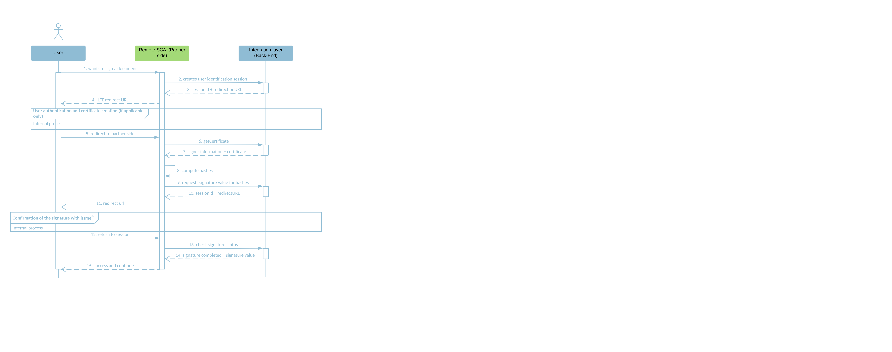

# 1. Introduction
itsme® is a trusted identity provider allowing partners to use verified identities for authentication and authorization on web desktop, mobile web and mobile applications. 

The objective of this document is to provide all the information needed to integrate the **Sign** service. 

At this moment only the Hash Signing variant is available and documented. In this variant, a remote Signature Creation Application (SCA) will provide the WYSIWYS experience to the User, provide the hash of the data to be signed to the itsme® service and use the returned digital signature value to format the signature in one of the AdES formats.

# 2. Audience 

This document is intended to be read by developers of any Signature Creation Application party. Partners who wish to use the itsme sign service through an existing SCA should refer to this SCA instead.

# 3. Prerequisites
 
Before you can integrate your application with itsme® Sign service, you MUST set up a project in the <a href="https://brand.belgianmobileid.be/d/CX5YsAKEmVI7" target="blank">itsme® B2B portal</a> to obtain all the needed information.

# 4. Integrating Sign services
The itsme® Sign flow goes through the steps shown in the sequence diagram below. 

<ol>
  <li>The User indicates on your end he wishes to sign a document with itsme®</li>
  <li>Your web desktop, mobile web or mobile SCA application sends a request to itsme® Integration Layer Back-End in order to create the User’s Identification session and obtain the User’s signing certificate to be include in the data to be signed.</li>
  <li>itsme® returns the session id and the redirect URL specific to the User to your SCA Back-End.</li>
  <li>Your SCA Front-End redirects the User to the Integration Layer Front-End of itsme®, meaning that the User will be identified in the meanwhile (in case the <i>"userCode"</i> is transmitted by the SCA, this step can be skipped as the user will already be identified). If the User has no signature certificate yet, the certificate creation process will be initiated automatically.</li>
  <li>Finally, when the User is authenticated and has a signature certificate, he is redirected to the your SCA Front-End. The redirection to your SCA Front-End SHOULD be (almost) transparent to the User (aka possible displaying of a spinner) as the laps of time between step 5 and step 11 of this diagram SHOULD be extremely short.</li>
  <li>Your SCA Back-End contacts the itsme® Integration Layer Back-End to get the signature certificate of the User.</li>
</ol>

<aside class="alert">Currently we only allow the signature of one single hash. Multiple hash signing is not yet available.</aside>

<ol>
  <li value="7">The itsme® Integration Layer Back-End returns your SCA Back-End the signer information as well as the signature certificate of the User.</li>
  <li>Your SCA Back-End constructs the data to be signed and the hash of the signature will be computed by yourself. The value of this hash MUST be base64url encoded.</li> 
  <li>Your SCA Back-End will provide the hash to the itsme® Integration Layer Back-End to request the digital signature value.</li>
  <li>A session id and redirect URL are returned by itsme® to your SCA Back-End.</li>
  <li>Your SCA frontend will then redirect the User to the signature webpage of itsme®, where some explanations about how to process the signature are displayed. Before being able to confirm the signature with the itsme® App, the User will also need to perform a security check, known as poka yoke, is also shown to the User. This consists of three icons that are displayed in the signature webpage, of which one is highlighted in tangerine. The User must make sure that the sequence of three icons displayed his App is the same as the one displayed in the signature webpage. To continue the confirmation of the action, the User must select in his App the icon that is highlighted in tangerine on the signature webpage.</li>    
  <li>The session of the User at itsme® side ends as the process is finished and the User is redirected to your SCA Front-End.</li>
  <li>Your SCA Back-End will contact the itsme® Integration Layer Back-End to check the signature status.</li>
  <li>itsme® then returns the signature completion status and the digital signature value.</li>
  <li>At this stage, your SCA is able to confirm the success of the operation and display a success message.</li>
</ol>

## 4.1. Checking itsme® Sign configuration

Two JSON documents are available to ease the integration of itsme sign service:
- The discovery document
- The swagger of the B2B interface

### Discovery document
To simplify implementations and increase flexibility, the following key-value pairs about itsme® configuration can be retrieved from a JSON document:

<ul>
  <li>the signature policies</li>
  <li>commitment types</li>
  <li>supported languages</li>
</ul>

The JSON document for itsme® Sign service may be retrieved from <a href="https://belgianmobileid.github.io/slate/qesdiscovery.json" target="blank">https://belgianmobileid.github.io/slate/qesdiscovery.json</a>

### B2B interface swagger

The swagger of the B2B interface (for the back-end to back-end calls) may be retrieved from <a href="https://belgianmobileid.github.io/slate/qesB2B.json" target="blank">https://belgianmobileid.github.io/slate/qesB2B.json</a>

## 4.2. Starting a new User identification session

This section relates to the step 2 of the sequence diagram.

First, you will forge a HTTPS POST request that MUST be sent to the itsme® User Identification Endpoint, which is https://b2b.sign.itsme.be/qes-partners/1.0.0/user_identification. Please note we are using SSLMA as authentication method, combined with IP filtering, as specified in [SSLMA Authentication](#SSLMA).

Below you will find a number of mandatory and recommended parameters to integrate in the HTTPS POST query string:

<code style=display:block;white-space:pre-wrap>POST /https://b2b.sign.itsme.be/qes-partners/1.0.0/user_identification HTTP/1.1
{
	"partnerCode":"myClientID", 
	"serviceCode":"myServiceCode", 
	"redirect_uri":"myServiceRedirectUri",
	"lang":"FR"
}</code>

Parameter | Type | Required | Description
:-------- | :-------- | :--------| :----- 
**partnerCode** | String | Required | This MUST be the client identifier you received when registering your application in the [itsme® B2B portal](#Onboarding).
**userCode** | String | Optional | An identifier for the User, unique among all itsme® accounts and never reused. Use <i>"userCode"</i> in the application as the unique-identifier key for the User.
**serviceCode** | String | Required | This parameter allows the application to express the desired scope. It MUST contain the value <i>"service:service_code"</i>, the itsme® service you want to use as defined for your application in the [itsme® B2B portal](#Onboarding).
**lang** | String | Optional | This parameters defines the recommended language to be used for GUI interaction. If the parameter is not defined in the request, then the language that will be used is the one of the cookie. This defaults to the language used in the browser if there is no cookie. 
**redirect_uri** | String | Required | This is the URI to which the User will be redirected to your remote SCA. This MUST exactly match the redirect URI of the specified service defined when registering your application in the [itsme® B2B portal](#Onboarding).

## 4.3. Capturing the Identification Response

### Capturing a successful Identification Code

If the User is successfully authenticated and authorizes access to the Identification Request, itsme® will return a response to your server component. This is achieved by returning an Identification Response to the <i>"redirect_uri"</i> specified previously in the Identification Request.
 
<code style=display:block;white-space:pre-wrap>{
    "status": "OK",
    "asyncRespId": "4kpr55zdi2mk9ns27awgngkltoenfy04gi9b",
    "identificationUrl": "https://uatmerchant.itsme.be/qes/identify_yourself?language=FR&q=ss4liz8kjk1xxz8taj3nbxae7zqty6eq"
}</code>

The response will contain:

Values | Type | Returned | Description
:----- |:-------- |:-------- |:---
**status** | String | Always | It is the status of User Identification Request.
**statusReason** | String | Always | It explains the reason of a failure. No reason is given in case the request status is pending or success. 
**asyncRespId** | String | Always | This parameter is the identifier of a User identification session. 
**identificationUrl** | String | Always | This is the itsme® URL of the signature welcome page. On this webpage the User will identify himself by entering his mobile phone number. 

### Handling Error Response

See [Appendixes](#Appendixes) to get more information on the error codes.

## 4.4 Redirecting the end user

The next step is to redirect the end user to our Front-End, so that we can process the identification session. You must do that by forging a GET request towards the url specified at previous step, in the parameter `identificationUrl`.

## 4.5. Requesting the User identification session status  

By calling the Identification Session Status Endpoint, you are checking the status of the User identification session. This endpoint is https://b2b.sign.itsme.be/qes-partners/1.0.0/user_identification/status. Please note we are using SSLMA as authentication method, combined with IP filtering, as specified in [SSLMA Authentication](#SSLMA).

Below you will find a number of mandatory and recommended parameters to integrate in the HTTPS POST query string:

<code style=display:block;white-space:pre-wrap>POST /https://b2b.sign.itsme.be/qes-partners/1.0.0/user_identification/status HTTP/1.1
{
	"partnerCode":"myPartnerCode", 
	"serviceCode":"myServiceCode", 
	"asyncRespID":"4kpr55zdi2mk9ns27awgngkltoenfy04gi9b"
}</code>

Parameter | Type | Required | Description
:-------- | :-------- | :--------| :----- 
**partnerCode** | String | Required | This MUST be the client identifier you received when registering your application in the [itsme® B2B portal](#Onboarding).
**serviceCode** | String | Required | This parameter allows the application to express the desired scope. It MUST contain the value <i>"service:service_code"</i>, the itsme® service you want to use as defined for your application in the [itsme® B2B portal](#Onboarding).
**asyncRespId** | String | Required | This parameter is the identifier of a User identification session. This value can be retrieved from the values obtained in the Identification Response.

## 4.6. Getting the User identification status info

If the Identification Session Status Request has been sucessfully validated we will return an HTTP 200 OK response as in the example aside. In other words, you will get the confirmation that the User can perform a Sign transaction with itsme® and retrieve the User certificate reference value.

The response body will include the following values:

<code style=display:block;white-space:pre-wrap>{
    "status": "OK",
    "userCode": "9o8f04wm1g0bdc8gmgcuxp2ehgn7txh0x2kq",
    "certificate": "user-certificate"
}</code>

Values | Type | Returned | Description
:----- |:-------- |:-------- |:---
**status** | String | Always | It is the status of User Identification Request.
**userCode** | String | Optional | An identifier for the User, unique among all itsme® accounts and never reused. Use <i>"userCode"</i> in the application as the unique-identifier key for the User.
**certificate** | String | Always | 

## 4.7. Starting a new Sign session 

In order to intiate the Sign session, you will forge a POST request towards this endpoint: https://b2b.sign.itsme.be/qes-partners/1.0.0/sign_document. Please note we are using SSLMA as authentication method, combined with IP filtering, as specified in [SSLMA Authentication](#SSLMA).

Below you will find the minimal set of parameters required for processing the HTTPS POST query string:

<code style=display:block;white-space:pre-wrap>POST /https://b2b.sign.itsme.be/qes-partners/1.0.0/sign_document HTTP/1.1
{
	"inDocs": {
		"docHash":[
			{
				"di":[
					{
						"alg":"http://www.w3.org/2001/04/xmlenc#sha256",
						"value":"f4OxZX/x/FO5LcGBSKHWXfwtSx+j1ncoSt3SABJtkGk="
					}
				],
				"id":"ContractCar20180914u89236456.pdf"
			}
		]
	},
	"reqID": "ReqID4va0acsef3mv5ft1dp71",
	"asyncRespID": null,
	"optInp": {
    	"profile": [
    		"urn:be:itsme:dss:1.0",
    		"urn:oasis:names:tc:dss:1.0:profiles:asynchronousprocessing",
     	],
    "policy": [],
    "lang": "FR",
    "nonce": null,
    "sigAlgo": null,
    "itsme": {
      "signer": {
        "userCode": "9o8f04wm1g0bdc8gmgcuxp2ehgn7txh0x2kq"
      },
      "partnerCode": "myPartnerCode",
      "serviceCode": "myServiceCode",
      "description": [
        {
          "lang": "EN",
          "value": "Car insurance contract"
        },
        {
          "lang": "FR",
          "value": "Contrat d'assurance voiture"
        },
        {
          "lang": "NL",
          "value": "Contract verzekering auto"
        },
        {
          "lang": "DE",
          "value": "Kfz-Versicherungsvertrag"
        }
      ],
      "callbackUrl": null,
      "redirectUrl": "myServiceRedirectUrl",
      "expiryTimestamp": null,
      "legalNotice": null,
      "signPolicy": {
        "signPolicyRef": "ITSME_DEFAULT",
        "commitmentTypeRef":"1.2.840.113549.1.9.16.6.5",
        "signerRole": [
          {
            "lang": "EN",
            "value": "General Manager"
          },
          {
            "lang": "FR",
            "value": "Gestionnaire"
          },
          {
            "lang": "NL",
            "value": "Zaakvoerder"
          },
          {
            "lang": "DE",
            "value": "Manager"
          }
        ]
      }
    }
  }
}</code>

Parameter | Type | Required | Description
:-------- | :-------- | :--------| :----- 
**inDocs** |  | Required | This contains the element to be signed. 
**docHash** |  | Required | This parameter defines the list of hashes to be signed by itsme®, one item per hash. 
**id** | String | Required | This is the ID of the hash(es) to be signed. You SHOULD provide us this information when registering your application in the [itsme® B2B portal](#Onboarding). Currently, only single hash signing is allowed. 
**di** | Array | Required | This is the Table of hashes to be signed during the signature process. 
**alg** | String | Required | Only the SHA256 algorithm is supported. See <a href="http://www.w3.org/2001/04/xmlenc#sha256" target="blank">http://www.w3.org/2001/04/xmlenc#sha256</a> for more information.
**value** | Array | Required | This is the hash to be signed during the signature flow. The value of the hash computed must be given in Base64.
**reqID** | String | Required | This is the ID of the request that you transfer.
**asyncRespId** | String | Optional | This parameter is the identifier of a User identification session. This value can be retrieved from the values obtained in the Identification Response. In case no <i>"asyncRespID"</i> is given in the request, a new session is created. 
**optInp** | String | Required | Those are additional information needed for the signature request.
**lang** | String | Optional | This parameters defines the recommended language to be used for GUI interaction. If the parameter is not defined in the request, then the language that will be used is the one of the cookie. This defaults to the language used in the browser if there is no cookie. 
**itsme** |  | Required | This parameter contains all the information related to itsme® context. 
**signer** | DssISigner | Required | This is all the information that allows identification of the User in itsme®.
**partnerCode** | String | Required | This MUST be the client identifier you received when registering your application in the [itsme® B2B portal](#Onboarding).
**serviceCode** | String | Required | This parameter allows the application to express the desired scope. It MUST contain the value <i>"service:service_code"</i>, the itsme® service you want to use as defined for your application in the [itsme® B2B portal](#Onboarding).
**redirect_uri** | String | Required | This is the URI to which the User will be redirected to your remote SCA. This MUST exactly match the redirect URI of the specified service defined when registering your application in the [itsme® B2B portal](#Onboarding).
**signPolicy** | DssISignPolicy | Required | This is the object of the Signature policy to be used during the Signature. This parameter contains all the information related to the signature policy. 
**signPolicyRef** | String | Optional | This defines the reference of the signature policy to be used during itsme® Signing flow. In case no specific signature policy is applicable for that specific use case, the itsme® generic qualified signature policy SHOULD be used. The signature policy has to be indicated in the SCA Front-End to the User. The list of available codes can be retrieved from the [JSON document](#OpenIDQES). The signature policies used SHOULD be defined in the [itsme® B2B portal](#Onboarding). It is up to you to choose your signature policies within the list given by itsme®. If you want to add new signature policies to your list, please ask the itsme® Onboarding team. 
**commitmentTypeRef** | String | Optional | This defines the reference of the commitment type to be used during itsme® Signing flow. This parameter is used to display (in the itsme® App) the commitment type of the signature to the User. There is no commitment type by default. If the parameter is not given by the SCA, then nothing is displayed in the itsme® App. You SHOULD use a code that corresponds to a specific commitment type. The list of available codes can be retrieved from the [JSON document](#OpenIDQES). The commitment types used SHOULD be defined in the [itsme® B2B portal](#Onboarding). It is up to you to choose your commitment types within the list given by itsme®. If you want to add new commitment types to your list, please ask the itsme® Onboarding team. 
**signerRole** | Array | Optional | This defines the role of the signer. This information is displayed in the itsme® App to show to the signer under which role he will sign the document. If no signer role is provided nothing will be displayed in the itsme® App. This parameter is optional and freely defined in a free text of maximum 50 characters by yourself. You SHOULD provide this free text in all supported languages. The characters used to define the Signer Role MUST be ISO-8859-1 compatible. The signer role SHOULD be provided in all languages supported by itsme®.

## 4.8. Managing the Sign Response 

### Getting a successful Sign Response

If the Sign Request has been sucessfully validated we will return an HTTP 200 OK response as in the example aside.

The response body will include the following values:

<code style=display:block;white-space:pre-wrap>{
    "result": {
        "maj": "urn:oasis:names:tc:dss:1.0:profiles:asynchronousprocessing:resultmajor:Pending"
    },
    "reqID": "ReqID4va0acsef3mv5ft1dp71",
    "respID": "hjg3ngu3tvvv71k9qg1vyokc2mwmqgqk43iv",
    "optOutp": {
        "itsme": {
            "signingUrl": "https://uatmerchant.itsme.be/qes/prove_its_you_poka?q=34u5jh2dltb1xhsu0g4bshnlziycdhow&language=FR"
        }
    }
}</code>

Values | Type | Returned | Description
:----- |:-------- |:-------- |:---
**result** |  | Always | This is the status of the request (pending, success or failure).
**maj** | String | Always | This is a general message that will give the status of the request, pending, success or error. In case of failure, the root cause is given.  
**min** | String | Always | This is a specific message that, in case of failure, identifies the root cause of the failure.
**msg** | String | Always | This indicates the origin of the error. 
**reqID** | String | Always | This is the ID of the request that you transfer. 
**asyncRespId** | String |  | This parameter is the identifier of a User identification session. 
**optOutp** | String |  | Those are additional information needed for the signature request.
**itsme** | String |  | This value contains all the information related to itsme® context.
**signingUrl** | String |  | This signing URL is the link to redirect the User from the SCA frontend  to the itsme® Signing Page. 
**userCode** | String |  | An identifier for the User, unique among all itsme® accounts and never reused. Use <i>"userCode"</i> in the application as the unique-identifier key for the User.
**sigObj** | Array |  | This is the signature object. Currently this is the hash to be signed.

### Handling Error Response

See [Appendixes](#Appendixes) to get more information on the error codes.

## 4.9 Redirecting the end user

The next step is to redirect the end user to our Front-End, so that we can process the identification session. You must do that by forging a GET request towards the url specified at previous step, in the parameter `signingUrl`.

## 4.10 Requesting the Sign session status
This request has to be created in order to get the information about the Sign session. In order to do so, you will forge a POST request towards https://b2b.sign.itsme.be/qes-partners/1.0.0/sign_document. Please note we are using SSLMA as authentication method, combined with IP filtering, as specified in [SSLMA Authentication](#SSLMA).

Below you will find the minimal set of parameters required for processing the HTTPS POST query string:
<code style=display:block;white-space:pre-wrap> POST /https://b2b.sign.itsme.be/qes-partners/1.0.0/sign_document HTTP/1.1
  {
  "inDocs": null, 
  "reqID": "ReqIDv1prg8pmn9mtive3otsc", 
  "asyncRespID": "b99a7d03acb94ea5a4d972aa31bb1c36",
  "optInp": {
              "itsme": {
                        "partnerCode":"myPartnerCode ", 
                        "serviceCode":"myServiceCode"
              }
        }
}
</code>

Parameter | Type | Required | Description
:-------- | :-------- | :--------| :----- 
**inDocs** |  | Required | This MUST be 'null'. 
**reqID** | String | Required | This is the ID of the request that you provide to us.
**asyncRespId** | String | Optional | This parameter is the identifier of a User identification session. This value can be retrieved from the values obtained in the Identification Response. In case no <i>"asyncRespID"</i> is given in the request, a new session is created. 
**optInp** | Json | Required | Those are additional information needed for the signature request.
**itsme** | Json | Required | This parameter contains all the information related to itsme® context. 
**partnerCode** | String | Required | This MUST be the client identifier you received when registering your application in the [itsme® B2B portal](#Onboarding).
**serviceCode** | String | Required | This parameter allows the application to express the desired scope. It MUST contain the value <i>"service:service_code"</i>, the itsme® service you want to use as defined for your application in the [itsme® B2B portal](#Onboarding).

## 4.11 Managing the Sign Status Response

### Getting a successful Sign Status Response

<code style=display:block;white-space:pre-wrap> HTTP200 
{ 

  "result": { 

    "maj": "urn:oasis:names:tc:dss:1.0:profiles:asynchronousprocessing:resultmajor:Pending" 

  }, 

  "reqID": "ReqIDv1prg8pmn9mtive3otsc", 

  "respID": "8lycz0t07bh1q8nz41fcwg21s9k8jd217vtp", 

  "optOutp": { 

    "itsme": { 

      "signingUrl": "http://itsme.labo.sixdots.be/qes/index.php?q=gjs57sq7w72eme0yg9ufufdfae98bcj6" 

    } 

  } 

}
</code>

Parameter | Type | Returned | Description
:-------- | :-------- | :--------| :----- 
**result** | String | Always | This is the Oasis DSS compliant status of the sign session
**reqID** | String | Always | This is the ID of the request that you provide to us.
**respID** | String | Always | needs to be reused later to check status of signature as asyncRespID value
**signingUrl** | String | Always | signingUrl is the link where you must redirect the end user. He will receive there BMID instructions and poka yoke code
**optOutp** | Json | Always | Those are additional information needed for the signature request.
**itsme** | Json | Always | This parameter contains all the information related to itsme® context. 
**signingUrl** | String | Always | This parameter allows the application to express the desired scope. It MUST contain the value <i>"service:service_code"</i>, the itsme® service you want to use as defined for your application in the [itsme® B2B portal](#Onboarding).

### Handling Error Response

See [Appendixes](#Appendixes) to get more information on the error codes.

# 5. Appendixes

## 5.1. Handling Error Response

If one of the above request is invalid or unauthorized an error code will be returned to the User using the appropriate HTTPS status code, as listed in the table below:

Status code | Description
:-- | :-- 
**400** | Returned in case of invalid Request Object.
**409** | Returned in case the User identification flow has been interrupted.
**500** | Internal Server Error.

The Error Response will contain the <i>"status"</i> and the `statusReason` value. The following table describes the various error types that can be returned in the `statusReason` value of the error response:

Status code | Error |  Description
:-------- | :-------- | :--------
**400** | NO_REQUEST | user_identification is a POST service. A body SHOULD be inserted into the request. For more information on the structure of this request, you can go to the section related to /user_identification.
<label></label> | MISSING_PARTNER_CODE | In this case, the body request does not contain the field "partnerCode". This field corresponds to the "Partner Code/Client ID" referenced in your onboarding file.
<label></label> | MISSING_SERVICE_CODE | The body request does not contain the field "serviceCode". This field corresponds to the "Service Code" referenced in your onboarding file.
<label></label> | INVALID_URL | The field "redirectUrl" is null or its syntax is not correct, URL is invalid. This field corresponds to the "Redirect URL" referenced in your onboarding file.
<label></label> | INVALID_REQUESTOR | The "partnerCode" and/or "serviceCode" referenced into the body do not reference an existing partner and/or service. The "partnerCode" corresponds to the "Partner Code/Client ID" referenced in your onboarding file. The "serviceCode" corresponds to the "Service Code" referenced in your onboarding file for a SIGN service.
<label></label> | UNAUTHORIZED_URL | The partner and its service have been correctly found by itsme® following referenced "partnerCode" and "serviceCode", but the given "redirectUrl" is not authorized for the partner and/or service mentioned. You did not provide a valid redirectUrl. The "redirectUrl" used here corresponds to the "Redirect URL" referenced in your onboarding file.
<label></label> | INVALID_LANG | The "lang" field does not reference a language supported by itsme®. You can consult "BMID Well-Known Configuration" to check which are the languages supported by  itsme®, /well-known/configuration.
<label></label> | UNEXPECTED_ERROR | An error occurred during the validation of partner information. You SHOULD try again later. If the error persists, then you SHOULD contact itsme® support team for investigation. 
<label></label> | UNKNOWN | An unknown error occurred during the request. You SHOULD contact itsme® support team for investigation.
**409** | PENDING | The User Identification Session you created is  pending. The User is currently following the User Identification flow at itsme® side (web and mobile).
<label></label> | REJECTED | The User had to create a certificate in order to make a signature. However, he rejected his CREATE_CERT action in the itsme® App. A new User Identification session must be initialized. During that session, User has to confirm the CREATE_CERT action.
<label></label> | EXPIRED | The User had to create a certificate in order to make a signature. However, he waited too long (more than three minutes) before confirming his CREATE_CERT action in the itsme® App and his action expired. A new User Identification Session must be initialized. During that session, User has to confirm the CREATE_CERT action in time.
<label></label> | UNEXPECTED_ERROR | An unexpected error occurred during User’s Identification flow. You SHOULD try again later. If the error persists, then you SHOULD contact itsme® support team for investigation.

## 5.2 SSLMA Authentication
We make use of SSLMA Authentication with our b2b interface (https://b2b.sign.itsme.be/qes-partners/1.0.0). This means that the SSL certificate you present upon each call towards this interface must be the one whitelisted in our systems as part of the onboarding process.
We combine this authentication with IP filtering, meaning that we need to whitelist the IP address of your server. This is also part of the onboarding process.
