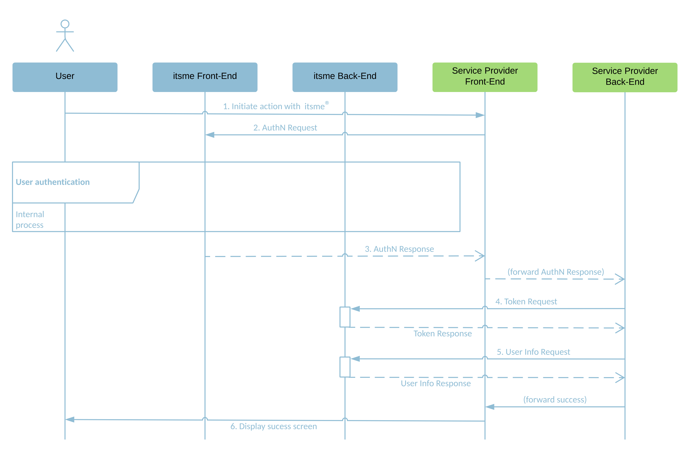

# 1. Introduction
itsme® is a trusted identity provider allowing partners to use verified identities for authentication and authorization on web desktop, mobile web and mobile applications. 

The objective of this document is to provide all the information needed to integrate the **Share Data** service using the <a href="http://openid.net/specs/openid-connect-core-1_0.html" target="blank">OpenID Connect Core 1.0 specifications</a>.

  

# 2. Prerequisites
 
Before you can integrate your application with itsme® Share Data service, you MUST set up a project in the <a href="https://brand.belgianmobileid.be/d/CX5YsAKEmVI7" target="blank">itsme® B2B portal</a> to obtain all the needed information.

# 3. Integrating Share Data service

The itsme® Share Data service integration is based on the <a href="http://openid.net/specs/openid-connect-core-1_0.html#CodeFlowAuth" target="blank">Authorization Code Flow</a> of OpenID Connect 1.0. The Authorization Code Flow goes through the steps as defined in <a href="http://openid.net/specs/openid-connect-core-1_0.html#CodeFlowSteps" target="blank">OpenID Connect Core Authorization Code Flow Steps</a>, depicted in the following diagram:
  
 
 
<ol>
  <li>The User indicates on your end he wishes to authenticate with itsme®</li>
  <li>Your web desktop, mobile web or mobile application (aka 'Relying Party' in the OpenID Connect specification) sends a request to itsme® (aka 'OpenID Provider' in the OpenID Connect specification) to authenticate the User. This request will redirect the User to the itsme® Front-End. itsme® then authenticates the User by asking him
    <ul type>
      <li>to enter his phone number on the itsme® OpenID web page</li>
      <li>authorize the release of some information’s to your application</li>
      <li>to provide his credentials (itsme® code or fingerprint or FaceID)</li>
    </ul>
  
  If you are building a mobile web or mobile application, the User don’t need to enter his mobile phone number on the itsme® OpenID web page, he will be automatically redirected to the itsme app via the Universal links or App links mechanism.</li>
  <li>Once the User has authorized the request and has been authenticated, itsme® will return an Authorization Code to the Service Provider Front-End, redirecting the user to your mobile or web application.</li>
  <li>The Service Provider Back-End calls the itsme® Token Endpoint and exchanges the Authorization Code for an ID Token identifying the User and an Access Token.</li>
  <li>The Service Provider Back-End MUST requests the additional User information from the itsme® userInfo Endpoint by presenting the Access Token obtained in the previous step.</li>
  <li>At this stage you are able to confirm the success of the operation and display a success message.</li>
</ol>

This flow is described in much more detail in the following sections.
 

## 3.1. Checking itsme® OpenID Provider configuration

To simplify implementations and increase flexibility, <a href="https://openid.net/specs/openid-connect-discovery-1_0.html" target="blank">OpenID Connect allows the use of a Discovery Document</a>, a JSON document containing key-value pairs which provide details about itsme® configuration, such as the URIs of the 

<ul>
  <li>Authorization, Token and userInfo Endpoints</li>
  <li>supported claims</li>
  <li>JWKSet URL</li>
  <li>...</li>
</ul>

The Discovery document for itsme® Share Data service MAY be retrieved from: 

Environment | URL
:-------- | :--------
**SANDBOX** | <a href="https://e2emerchant.itsme.be/oidc/.well-known/openid-configuration" target="blank">https://e2emerchant.itsme.be/oidc/.well-known/openid-configuration</a>
**PRODUCTION** | <a href="https://merchant.itsme.be/oidc/.well-known/openid-configuration" target="blank">https://merchant.itsme.be/oidc/.well-known/openid-configuration</a>

## 3.2. Forging an Authentication Request

First, you will forg a HTTPS GET request that MUST be sent to the itsme® Authorization Endpoint. The itsme® Authorization Endpoint can be retrieved from the [itsme® Discovery document](#OpenIDConfig), using the key <i>"authorization_endpoint"</i>.

<aside class="alert">By opposition to the OpenID Connect specifications, POST method is not authorized when triggering the itsme® App through the Universal/App Link mechanism only support the HTTP GET method on the Authorisation Endpoint. More information about Universal links and App links can be found in the <a href="#UniversalLinks">section 3.4</a>.
</aside>

The OpenID Connect Core specification defines a number of mandatory and recommended parameters to integrate in the HTTPS GET query string:

Parameter | Required | Description
:-------- | :--------| :----- 
**client_id** | Required |This is the client ID you received when registering your project in the [itsme® B2B portal](#Onboarding).
**response_type** | Required | This defines the processing flow to be used when forming the response. Because itsme® uses the Authorization Code Flow as described above, this value MUST be <i>"code"</i>.
**scope** | Required | The scope parameter allows the application to express the desired scope of the access request. It MUST contain the value <i>"openid"</i> and <i>"service:share_data_service_code"</i>, by replacing "share_data_service_code" with the code you received when registering your project in the [itsme® B2B portal](#Onboarding). You SHALL also specify additional scopes, separated by spaces, to request more information about the User. Depending on your use case, the following additional scopes SHALL apply:<ul><li>profile: will request the claims representing basic profile information. These are <i>"family_name"</i>, <i>"given_name"</i>, <i>"gender"</i>, <i>"birthdate"</i> and <i>"locale"</i>.</li><li>email: will request the <i>"email"</i> and <i>"email_verified"</i> claims.</li><li>phone: will request the <i>"phone_number"</i> and <i>"phone_number_verified"</i> claims.</li><li>address: will request the <i>"street_address"</i>, <i>"locality"</i>, <i>"postal_code"</i> and <i>"country"</i> claims.</li></ul>For more information on User attributes or claims, please consult the [ID claims](#Data) section.  An HTTP ERROR <i>"not_implemented"</i> will be returned if the required values are not specified.  Unrecognised values will be ignored. 
**redirect_uri** | Required | This is the URI to which the authentication response should be sent. This MUST exactly match the redirect URI of the specified service defined when registering your project in the [itsme® B2B portal](#Onboarding).
**state** | Strongly RECOMMENDED | An opaque value used in the Authentication Request, which will be returned unchanged in the Authorization Code. This parameter SHOULD be used for preventing cross-site request forgery (XRSF).  When deciding how to implement this, one suggestion is to use a private key together with some easily verifiable variables, for example, your client ID and a session cookie, to compute a hashed value. This will result in a byte value that will be infeasibility difficult to guess without the private key. After computing such an HMAC, base-64 encode it and pass it to the Authorization  Server as <i>"state"</i> parameter. Another suggestion is to hash the current date and time. This requires your application to save the time of transmission in order to verify it or to allow a sliding period of validity. 
**nonce** | Strongly RECOMMENDED | A string value used to associate a session with an ID Token, and to mitigate replay attacks. The value is passed through unmodified from the Authentication Request to the ID Token. Sufficient entropy MUST be present in the <i>"nonce"</i> values used to prevent attackers from guessing values. See <a href="http://openid.net/specs/openid-connect-core-1_0.html#NonceNotes" target="blank">OpenID Connect Core specifications</a> for more information.
**login_hint** | Optional | Hint to the Authorization Server about the login identifier the User might use to log in (if necessary). If provided, this value MUST be a phone number in the format specified for the <i>"phone_number"</i> claim: <i>"<countrycode>+<phonenumber>"</i>. E.g. <i>"login_hint=32+123456789"</i>.  <i>"login_hint"</i> with invalid syntax will be ignored. 
**display** | Optional | ASCII string value that specifies how the Authorization Server displays the authentication and consent User interface pages to the User. MUST be <i>"page"</i> if provided. Other values will yield an HTTP ERROR <i>"not_implemented"</i>. 
**prompt** | Optional | Space delimited, case sensitive list of ASCII string values that specifies whether the Authorization Server prompts the User for reauthentication and consent. MUST be <i>"consent"</i> if provided. 
**ui_locales** | Optional | User's preferred languages and scripts for the User interface (e.g.: OpenID web page). Supported values are: <i>"fr"</i>, <i>"nl"</i>, <i>"en"</i> and <i>"de"</i>. Any other value will be ignored.
**max_age** | Not supported | Any supplied value will be ignored. As itsme® does not maintain a session mechanism, an active authentication is always required. 
<a name="acrvalues">**acr_values**</a> | Optional | Space-separated string that specifies the acr values that the Authorization Server is being requested to use for processing this Authentication Request, with the values appearing in order of preference. 2 values are supported:<ul><li>Basic level - let the User to choose either fingerprint usage (if device is compatible) or PIN <i>"tag:sixdots.be,2016-06:acr_basic"</i> </li><li>Advanced level - force the User to use PIN <i>"tag:sixdots.be,2016-06:acr_advanced"</i> </li></ul>When multiple values are provided only the most constraining will be used (advanced > basic). If not provided basic level will be used.  More information on security levels and context data can be found in the [Appendixes](#SecurityLevels). 
**claims** | Optional | This parameter SHALL be used to request specific claims. The value is a JSON object listing the requested claims. When passed as a HTTP GET parameter, the <i>"claims"</i> parameter value is represented as UTF-8 encoded JSON which ends up being form-urlencoded. When used in a Request Object value, see [Appendixes](#RequestObjectByValue), the JSON is used as the value of the claims member. See [User Data](#Data) for more information. 
**request** | Optional | This parameter enables OpenID Connect requests to be passed in a single, self-contained parameter, and to be optionally signed with your private key and/or encrypted with the itsme® public key. The parameter value is a Request Object value. It represents the request as a JWT. See <a href="#RequestObjectByValuei">Using request parameter</a> section for more information. 
**request_uri** | Optional | This parameter MUST be used when the GET request lenght is too long. This parameter enables OpenID Connect requests to be passed by reference, rather than by value. The <i>"request_uri"</i> value is a URL using the https scheme referencing a resource containing a Request Object value, which is a JWT containing the request parameters. The URL MUST be shared with us when registering your project in the [itsme® B2B portal](#Onboarding). See <a href="#RequestUri">Using request_uri parameter</a> for more details. 
**response_mode** | Not supported | Any supplied value will be ignored.
**id\_token\_hint** | Not supported | Any supplied value will be ignored.
**claims_locales** | Not supported | Any supplied value will be ignored.
**registration** | Not supported | Any supplied value will be ignored.

The following is a non-normative example request that would be sent to the Authorization Server:

<code style=display:block;white-space:pre-wrap>GET /authorization HTTP/1.1
Host: server.itsme.be
?response_type=code 
&scope=openid%20profile%20email%20service%3Aclient.registration
&client_id=s6BhdRkqt3
&state=af0ifjsldkj
&redirect_uri=https%3A%2F%2Fclient.example.org%2Fcb HTTP/1.1
&claims=
  {
  "userinfo":
    {
      "tag:sixdots.be,2016-06:claim_nationality":null,
      "tag:sixdots.be,2016-06:claim_gender":null,
      "tag:sixdots.be,2016-06:claim_birthplace":null,
      "tag:sixdots.be,2017-05:claim_device":null
    }
  }</code>

## 3.3. Capturing an Authorization Code

### Capturing a successful Authorization Code

If the User is successfully authenticated and authorizes access to the data requested, itsme® will return an Authorization Code to your server component. This is achieved by returning an Authentication Response, which is a HTTP 302 redirect request to the <i>"redirect_uri"</i> specified previously in the Authentication Request. The following is a non-normative example of a successful Authentication Response:
 
<code style=display:block;white-space:pre-wrap>HTTP/1.1 302 Found
Location: https://client.example.org/cb?
code=SplxlOBeZQQYbYS6WxSbIA&
state=af0ifjsldkj</code>

The response will contain:

Values | Returned | Description
:----- |:-------- |:---
**code** | Always |The <i>"code"</i> parameter holds the Authorization Code which is a string value. The content of Authorization Code is opaque for you. This code has a lifetime of 3 minutes.
**state** | If provided |The <i>"state"</i> parameter will be returned if you provided a value in the Authentication Request. You should validate that the value returned matches the one supplied in the Authentication Request. The state value can additionally be used to mitigate against XSRF attacks by cryptographically binding the value of this parameter with a browser cookie. If a wrong/unknown <i>"state"</i> is received, you should take it into account and refuse the related <i>"code"</i> or from a security detection/prevention point of view, monitor if it is a recurring pattern or not. 

 
### Handling Authentication Error Response

If the request fails due to a missing, invalid, or mismatching redirection URI, or if the client identifier is missing or invalid, the Authorization Server SHOULD inform the User of the error and MUST NOT automatically redirect him to the invalid redirection URI. 

If the User denies the Authentication Request or if the request fails for reasons other than a missing or invalid redirection URI, itsme® will return an error response to your application. As for a successful response this is achieved by returning a HTTPS 302 redirect request to the redirection_uri specified in the Authentication Request. The error response parameters are the following:

Values |	Returned | Description
:--|:--|:--
**error**	| Always |	Error type. 
**error_description** |	Always	| Indicating the nature of the error
**state** |	If provided	| Set to the value defined in the Authorisation Request, if any.

The following is a non-normative example of an error response:

<code style=display:block;white-space:pre-wrap>HTTP/1.1 302 Found
Location: https://client.example.org/cb?
error=invalid_request
&error_description=Unsupported%20response_type%20value
&state=af0ifjsldkj</code>

The following table describes the various error codes that can be returned in the <i>"error"</i> parameter of the error response:

Error | Description
:-- | :-- 
**interaction_required**  | The Authorization Server requires User interaction of some form to proceed.
**invalid_request_object** | The <i>"request"</i> parameter contains an invalid Request Object.
**request_uri_not_supported** | This error is returned because itsme® does not support use of the <i>"request_uri"</i> parameter defined in the JWTs.
**registration_not_supported** | This error is returned because itsme® does not support use of the <i>"registration"</i> parameter.

All other HTTPS errors unrelated to OpenID Connect Core will be returned to the User using the appropriate HTTPS status code.

 
## 3.4. Supporting Universal Links and App Links mechanism
Regardless of the application you are building you should make sure that your redirect URIs support the <a href="https://developer.apple.com/ios/universal-links/" target="blank">Universal links</a> and <a href="https://developer.android.com/studio/write/app-link-indexing" target="blank">App links</a> mechanism. Functionally, it will allow you to have only one single link that will either open your desktop web application, your mobile app or your mobile site on the User’s device.

Universal links and App links are standard web links (http://mydomain.com) that point to both a web page and a piece of content inside an app. When a Universal Link is opened, the app OS checks to see if any installed app is registered for that domain. If so, the app is launched immediately without ever loading the web page. If not, the web URL is loaded into the webbrowser.

An App link is the Android version of the Universal link.

How do Universal Links work in iOS and Android ? Before Universal Links, the primary mechanism to open up an app when it was installed was by trying to redirect to an app’s URI scheme  in the web browser. But there was no way to check if the app was installed or not. This meant that developers would try to call the URI scheme 100% of the time, in the off chance that the app was installed, then fallback gracefully to the App Store or Google Play Store when not by using a timer.

iOS Universal Links and Android App Links were intended to fix this. Instead of opening up the web browser first when a link is clicked, the OS will check if a Universal Link has been registered (a file should be there in the domain which contains the bundle id of the app and the paths the app should open) for the domain associated with the link, then check if the corresponding app is installed. If the app is currently installed, it will be opened. If it’s not, the web browser will open and the HTTPS link will load.

The specifications for the implementation of Universal links and App links can be found in the [Appendix](#Appendixes).

## 3.5. Exchanging the Authorization Code 
 

Once your server component has received an [Authorization Code](#AuthNResponse), your server can exchange it for an Access Token and an ID Token.

<aside class="notice">You might also read in the OpenID Connect Core specification about the Refresh Token, but we don't support them (we don't implement any session mechanism).</aside>

Your server makes this exchange by sending an HTTPS POST request to the itsme® Token Endpoint URI. This URI can be retrieved from the [itsme® Discovery document](#OpenIDConfig), using the key <i>"token_endpoint"</i>.

<aside class="notice">An Authorization Code can only be exchanged once. Attempting to re-exchange a code will generate a bad request response, outlined below in the section <a href="https://belgianmobileid.github.io/slate/login.html#3-6-managing-id-token-response" target="blank">Handling token error response</a>.</aside>

The request MUST include the following parameters in the POST body:

Parameter | Required | Description
:-- | :-- | :--
**grant_type** | Required | This MUST be set to <i>"authorization_code"</i>.
**code** | Required | The Authorization Code received in response to the Authentication Request.
**redirect_uri** | Required | The redirection URI supplied in the original Authentication Request. This is the URL to which you want the User to be redirected after the authorization is complete.
**client_assertion** | Required | To ensure that the request is genuine and that the tokens are not returned to a third party, you will be authenticated when making the Token Request. The OpenID Connect Core specifications support multiple authentication methods, but itsme® only supports <i>"private_key_jwt"</i>. This authentication method uses a JWT signed with the private key corresponding to the public key you have registered when setting up your project in the [itsme® B2B portal](#Onboarding). The JWT MUST be sent as the value of the <i>"client_assertion"</i> parameter.  See the <a href="https://belgianmobileid.github.io/slate/jose.html" target="blank">JOSE</a> specifications for more information. 
**client\_assertion\_type** | Required | This MUST be set to <i>"urn:ietf:params:oauth:client-assertion-type:jwt-bearer"</i>. 

The following is a non-normative example of a request to obtain an ID Token and Access Token:

<code style=display:block;white-space:pre-wrap>POST /token HTTP/1.1
Host: server.example.com
Content-Type: application/x-www-form-urlencoded
grant_type=authorization_code&
code=i1WsRn1uB1&
client_assertion_type=urn%3Aietf%3Aparams%3Aoauth%3Aclient-assertion-type%3Ajwt-bearer&
client_assertion=PHNhbWxwOl ... ZT</code>

According to the <i>"private_key_jwt"</i> client authentication method, the <i>"client_assertion"</i> JWT MUST contain the following parameters in the JWT Payload:

Parameter | Description
:-- | :-- 
**iss** | The issuer of the <i>"private_key_jwt"</i>. This MUST contain the <i>"client_id"</i>. This is the client identifier (e.g. : Project ID) you received when registering your project in the [itsme® B2B portal](#Onboarding).
**sub** | The subject of the <i>"private_key_jwt"</i>. This MUST contain the <i>"client_id"</i>. This is the client identifier (e.g. : Project ID) you received when registering your project in the [itsme® B2B portal](#Onboarding).
**aud** | Value that identifies the Authorization Server as an intended audience. This MUST be the itsme® Token Endpoint URL: <i>"https://merchant.itsme.be/oidc/token"</i>.
**jti** | The <i>"jti"</i> (JWT ID) claim provides a unique identifier for the JWT. The identifier value MUST be assigned by the you in a manner that ensures that there is a negligible probability that the same value will be accidentally assigned to a different data object; if the application uses multiple issuers, collisions MUST be prevented among values produced by different issuers as well.  The <i>"jti"</i> claim can be used  to prevent the JWT from being replayed. The <i>"jti"</i> value is a case-sensitive string. 
**exp** | The <i>"exp"</i> (expiration time) claim identifies the expiration time on or after which the JWT MUST NOT be accepted for processing.  The processing of the <i>"exp"</i> claim requires that the current date/time MUST be before the expiration date/time listed in the <i>"exp"</i> claim. Implementers MAY provide for some small leeway, usually no more than a few minutes, to account for clock skew.  Its value MUST be a number containing a NumericDate value (e.g. 1538507868 for Tuesday, March 22, 2011 6:43:00 PM).

## 3.6. Managing Token Response

### Extracting a successful Token Response

If the Token Request has been sucessfully validated we will return an HTTP 200 OK response including ID and Access Tokens as in the example below:

<code style=display:block;white-space:pre-wrap>HTTP/1.1 200 OK
Content-Type: application/json
Cache-Control: no-store
Pragma: no-cache
{
  "access_token": "SlAV32hkKG",
  "token_type": "Bearer",
  "expires_in": 3600,
  "id_token": "eyJhbGciOiJSUzI1NiIsImtpZCI6IjFlOWdkazcifQ.ewogImlzc
  yI6ICJodHRwOi8vc2VydmVyLmV4YW1wbGUuY29tIiwKICJzdWIiOiAiMjQ4Mjg5
  NzYxMDAxIiwKICJhdWQiOiAiczZCaGRSa3F0MyIsCiAibm9uY2UiOiAibi0wUzZ
  fV3pBMk1qIiwKICJleHAiOiAxMzExMjgxOTcwLAogImlhdCI6IDEzMTEyODA5Nz
  AKfQ.ggW8hZ1EuVLuxNuuIJKX_V8a_OMXzR0EHR9R6jgdqrOOF4daGU96Sr_P6q
  Jp6IcmD3HP99Obi1PRs-cwh3LO-p146waJ8IhehcwL7F09JdijmBqkvPeB2T9CJ
  NqeGpe-gccMg4vfKjkM8FcGvnzZUN4_KSP0aAp1tOJ1zZwgjxqGByKHiOtX7Tpd
  QyHE5lcMiKPXfEIQILVq0pc_E2DzL7emopWoaoZTF_m0_N0YzFC6g6EJbOEoRoS
  K5hoDalrcvRYLSrQAZZKflyuVCyixEoV9GfNQC3_osjzw2PAithfubEEBLuVVk4
  XUVrWOLrLl0nx7RkKU8NXNHq-rvKMzqg"
}</code>

The response body will include the following values:

Values | Returned | Description
:-- | :-- | :--
**access_token** | Always | The Access Token which may be used to access the userInfo Endpoint.
**token_type** | Always | Set to <i>"Bearer"</i>.
**id_token** | Always | The ID Token is a JSON Web Token (JWT) that contains User profile information (like the User's name, email, and so forth), represented in the form of claims. 
**at_hash** | Not supported | itsme® does not provide any value for this parameter.
**refresh_token** | Not supported | itsme® does not provide any value for this parameter as it only maintains short-lived session to enforce re-authentication.

With the following claims returned in the <i>"id_token"</i>: 

Values |	Returned |	Description
:-- | :-- | :--
**iss**	| Always | Identifier of the issuer of the ID Token.
**sub** |	Always | An for the User, unique among all itsme® accounts and never reused. Use <i>"sub"</i> in the application as the unique-identifier key for the User. It has 32 characters.
**aud**	| Always |	Audience of the ID Token. This will contain the <i>"client_id"</i>. This is the client identifier (e.g. : Project ID) you received when registering your project in the [itsme® B2B portal](#Onboarding).
**exp**	| Always |	Expiration time on or after which the ID Token MUST NOT be accepted for processing.
**iat** |	Always	| The time the ID Token was issued, represented in Unix time (integer seconds).
**auth_time** | Always | The time the User authentication occurred, represented in Unix time (integer seconds). 
**nonce** | If provided | String value used to associate a session with an ID Token, and to mitigate replay attacks. The value is passed through unmodified from the Authentication Request to the ID Token. Sufficient entropy MUST be present in the <i>"nonce"</i> values used to prevent attackers from guessing values. See <a href="http://openid.net/specs/openid-connect-core-1_0.html#NonceNotes" target="blank">the OpenID Connect Core specifications</a> for more information.
**acr** | If provided | Could be <i>"tag:sixdots.be,2016-06:acr_basic"</i> or <i>"tag:sixdots.be,2016-06:acr_advanced"</i> depending on the value entered in the <i>"acr_values"</i>  Authorisation Request parameter. If no value is provided in the <i>"acr_values"</i> parameter, the <i>"acr"</i> will contain <i>"tag:sixdots.be,2016-06:acr_basic"</i>.
**amr** | Never |
**azp** | Never |

However, before being able to store and use the returned values from <i>"id_token"</i>, you will first need to validate it by following the the ID Token validation rules described in the section below.

### ID Token validation

You MUST validate the ID Token in the Token Response in the following manner:

<ol>
  <li>As the ID Token is a Nested JWT object, you will have to decrypt and verify it using the keys and algorithms that you specified when registering your project in the [itsme® B2B portal](#Onboarding). The process of decryption and signature validation is described in <a href="https://belgianmobileid.github.io/slate/jose#4-3-decrypting" target="blank">section 4.3</a> of the JOSE specifications. If the ID Token is not encrypted, you SHOULD reject it. </li>
  <li>The Issuer identifier for itsme® (which is obtained by using the key <i>"issuer"</i> in the <a href="#OpenIDConfig" target="blank">itsme® Discovery document</a>) MUST exactly match the value of the <i>"iss"</i> claim.</li>
  <li>You MUST validate that the <i>"aud"</i> claim contains your <i>"client_id"</i> value registered in the <a href="#Onboarding" target="blank">itsme® B2B portal</a>. The ID Token MUST be rejected if the ID Token does not list the <i>"client_id"</i> as a valid audience.</li>
  <li>The current time MUST be before the time represented by the <i>"exp"</i> claim.</li>
</ol>

If all the above verifications are successful, you can use the subject (<i>"sub"</i>) of the ID Token as the unique identifier of the corresponding User.

### Handling token error response 

If the Token Request is invalid or unauthorized an HTTP 400 response will be returned as in the example:

<code style=display:block;white-space:pre-wrap>HTTP/1.1 400 Bad Request
Content-Type: application/json
Cache-Control: no-store
Pragma: no-cache
{
  "error": "invalid_request"
}</code>

The response will contain an error parameter and optionally <i>"error_description"</i> and <i>"error_uri"</i> parameters. The <i>"error_uri"</i> parameter may be used by implementations to specify a human-readable web page with information about the error, used to provide the client developer with additional information about the error.

## 3.7. Obtaining User attributes or claims

### Creating the userInfo Request 

OpenID Connect Core specifications also allow your application to obtain basic profile information about a specific User in a interoperable way. This is achieved by sending a HTTPS GET request to the itsme® userInfo Endpoint, passing the Access Token value in the Authorization header using the Bearer authentication scheme. The itsme userInfo Endpoint URI can be retrieved from the [itsme® Discovery document](#OpenIDConfig), using the key <i>"userinfo_endpoint"</i>.

<code style=display:block;white-space:pre-wrap>GET https://merchant.itsme.be/oidc/userinfo HTTP/1.1
Authorization: Bearer <access token></code>

### Managing the userInfo Response 

The itsme® userInfo Endpoint will return a HTTP 200 OK response and the User claims in a Nested JWT format. The following is a non-normative example of a UserInfo Response:

<code style=display:block;white-space:pre-wrap>HTTP/1.1 200 OK
  Content-Type: application/json
  {
   "sub": "248289761001",
   "name": "Jane Doe",
   "given_name": "Jane",
   "family_name": "Doe",
   "preferred_username": "j.doe",
   "email": "janedoe@example.com",
   "picture": "http://example.com/janedoe/me.jpg"
  }</code>

<aside class="notice">For privacy reasons itsme® may elect to not return values for some requested claims. In that case the claim will be omitted from the JSON object rather than being present with a null or empty string value.</aside>

However, before being able to consume the claims from the userInfo response, you will first need to validate it by following the userInfo response validation rules described in the section below.

### UserInfo response validation

You MUST validate the userInfo reponse in the following manner:

<ol>
  <li>As the userInfo response is a Nested JWT object, you will have to decrypt and verify it using the keys and algorithms that the you specified when registering your project in the [itsme® B2B portal](#Onboarding). The process of decryption and signature validation is described in <a href="https://belgianmobileid.github.io/slate/jose#4-3-decrypting" target="blank">section 4.3</a> of the JOSE specifications. If the userInfo response is not encrypted, the you SHOULD reject it. </li>
  <li>The <i>"sub"</i> claim will always be included in the response and this should be verified by you to mitigate against token substitution attacks. The <i>"sub"</i> claim in the userInfo response MUST be verified to exactly match the <i>"sub"</i> claim in the <i>"id_token"</i>; if they do not match, the userInfo response values MUST NOT be used.</li>
</ol>

When an error condition occurs an error response as defined in the <a href="https://tools.ietf.org/html/rfc6750" target="blank">OAuth 2.0 Bearer Token Usage specification</a> will be returned.

###  Capturing claims from the 'scope' parameter

On top of the <i>"openid"</i> and <i>"service:share_data_service_code"</i> values specified in the Authentication Request, you SHALL also ask for additional scopes, separated by spaces, to request more information about the User. The following additional scopes SHALL apply:

Parameter | Description
:-- | :-- 
**profile** | It will request the claims representing basic profile information. These are <i>"family_name"</i>, <i>"given_name"</i>, <i>"gender"</i>, <i>"birthdate"</i> and <i>"locale"</i>.
**email** | It will request the <i>"email"</i> and <i>"email_verified"</i> claims.
**phone** | It will request the <i>"phone_number"</i> and <i>"phone_number_verified"</i> claims
**address**  | It will request the <i>"street_address"</i>, <i>"locality"</i>, <i>"postal_code"</i> and <i>"country"</i> claims.

The values returned via the itsme® userInfo Endpoint are those below:

Values |	Returned |	Description
:--- | :--- | :---
**family_name** | If requested | 
**given_name** | If requested | 
**gender** | If requested | 
**birthdate** | If requested | 
**locale** | If requested | The language of the User
**email** | If requested | The User's email address. This may not be unique and is not suitable for use as a primary key. Provided only if your scope included the string "email".
**email_verified** | If requested | <i>"true"</i> if the User's e-mail address has been verified; otherwise <i>"false"</i>.
**phone_number** | If requested | 
**phone_number_verified** | If requested | 
**street_address** | If requested | 
**locality** | If requested | 
**postal_code** | If requested | 
**country** | If requested | 

###  Capturing claims from the 'claims' parameter

Typically, the values returned via the <i>"scope"</i> parameter only contain claims about the identity of the User. More information about the User SHALL be requested by including additional parameters in the <i>"claims"</i> parameter as specified below:

Parameter | Description
:-- | :-- 
**tag:sixdots.be,2016-06:claim_nationality** | It will request the <i>"nationality"</i> claim.
**tag:sixdots.be,2016-06:claim_city_of_birth** | It will request the <i>"place of Birth - city"</i> claim.
**tag:sixdots.be,2016-06:claim_eid**  | It will request the <i>"eid"</i>, <i>"issuance_locality"</i>, <i>"validity_from"</i>, <i>"validity_to"</i>, <i>"certificate_validity"</i> and <i>"read_date"</i> claims
**tag:sixdots.be,2017-05:claim_device** | It will request the <i>"os"</i>, <i>"appName"</i>, <i>"appRelease"</i>, <i>"deviceLabel"</i>, <i>"debugEnabled"</i>, <i>"deviceID"</i>, <i>"osRelease"</i>, <i>"manufacturer"</i>, <i>"hasSimEnabled"</i>, <i>"deviceLockLevel"</i>, <i>"smsEnabled"</i>, <i>"rooted"</i>, <i>"imei"</i>, <i>"deviceModel"</i> and <i>"sdkRelease"</i> claims.
**tag:sixdots.be,2017-05:claim_transaction_info** | It will request the <i>"securityLevel"</i>, <i>"bindLevel"</i> and <i>"mcc"</i> claims.
**tag:sixdots.be,2017-05:2017-05:claim_photo** | It will request the <i>"e-ID Picture"</i> claim.

The values returned via the itsme® userInfo Endpoint are those below:

Values | Description
:-- | :-- 
**nationality** | 
**place of Birth - city** | 
**eid**  | The eID card serial number.
**issuance_locality**  | The eID card issuance locality.
**validity_from**  | The eID card validity “from” date.
**validity_to**  | The eID card validity “to” date.
**certificate_validity**  | The eID card certificate validity.
**read_date**  | The data extraction date. The date is encoded using ISO 8601 UTC (timezone) date format (example: 2017-04-01T19:43:37+0000).
**os** | The device operating system. The returned values will be <i>"ANDROID"</i> or <i>"iOS"</i>
**appName**  | The application name.
**appRelease**  | The application current release.
**deviceLabel**  | The name of the device.
**debugEnabled**  | <i>"True"</i> if debug mode has been activated; otherwise <i>"false"</i>.
**deviceId**  | The device identifier.
**osRelease**  | The version of the OS running on your device.
**manufacturer**  | The brand of the device manufacturer.
**hasSimEnabled**  | It tells you if a SIM card is installed in the device, or not. The returned value is always <i>"true"</i> as long as itsme® can't be installed on tablets.
**deviceLockLevel**  |
**smsEnabled**  |
**rooted**  | The returned value is always <i>"false"</i> as long as itsme® can't be used on a jailbreaked/rooted device.
**imei**  | The device IMEI value.
**deviceModel**  | The model of the device.
**sdkRelease**  |
**securityLevel** | The security level used during transaction. The returned values could be <i>"SOFT_ONLY"</i>, <i>"SIM_ONLY"</i> or <i>"SIM_AND_SOFT"</i>.
**bindLevel**  | It tells you if the User account is bound to a SIM card or not, at the time the transaction occurred. The returned values could be <i>"SOFT_ONLY"</i>, <i>"SIM_ONLY"</i> or <i>"SIM_AND_SOFT"</i>.
**mcc**  | The Mobile Country Code. The returned value is an Integer (three digits) representing the mobile network country.
**e-ID Picture** | 

# 4. Mapping the User

To sign in successfully in your web desktop, mobile web or mobile application, a given user must be provisioned in OpenID Connect and then mapped to a user account in your database. By default, your application Server will use the subject identifier, or <i>"sub"</i> claim, in the ID Token to identify and verify a user account. Typically, the <i>"sub"</i> claim is a unique string that identifies a given user account. The benefit of using a <i>"sub"</i> claim is that it will not change, even if other user attributes (email, phone number, etc) associated with that account are updated. 

The <i>"sub"</i> claim value must be mapped to the corresponding user in your application Server. If you already mapped this <i>"sub"</i> to an account in your application repository, you should start an application session for that User.

If no user record is storing the <i>"sub"</i>  claim value, then you should allow the User to associate his new or existing account during the first sign-in session.

All these flows are depicted in the <a href="https://brand.belgianmobileid.be/document/39#/ux/ux-flows" target="blank">itsme® B2B portal</a>.

In a limited number of cases (e.g. change phone number, technical issue,…) a user could ask itsme® to ‘delete’ his account. As a result the specific account will be ‘archived’ (for compliancy reasons) and thus also the unique identifier(s) (e.g. <i>"sub"</i>), used to interact with the different Service Providers the specific users is active with, will be automatically deleted in our database.

If the same user would opt to (re)create an itsme® afterwards, he will need to re-bind his itsme® account with your application server (as the initial identifier is no longer valid as explained before). To re-bind his itsme® account one of the above scenario should be used. After successful (re)binding you will need to overwrite the initial reference with the new ‘sub’ claim value in your database.

 
# 5. Appendixes
 

## 5.1. Universal Links on iOS

<code style=display:block;white-space:pre-wrap>{
  "applinks": {
    "apps": [],
    "details": [
      {
        "appID": “JHGFJHHYX.com.facebook.ios",
        "paths": [
          "*"
        ]
      }
    ]
  }
}</code>

Integration is going to be pretty straightforward, all details can be found in below steps (as documented on <a href="https://developer.apple.com/ios/universal-links/" target="blank">Universal Links official documentation</a>):

<ol>
  <li>Register your app at developer.apple.com.</li>
  <li>Enable ‘Associated Domains’ on your app identifier.</li>
  <li>Enable ‘Associated Domain’ on in your Xcode project.</li>
  <li>Add the proper domain entitlement and make sure the entitlements file is included at build: Xcode will do it automatically by itself.</li>
  <li>Create the ‘apple-app-site-association’ file (AASA). The AASA file contains a JSON object with a list of apps and the URL paths on the domain that should be included or excluded as Universal Links. The JSON object will contain: </li>
</ol>

Parameter |	Description
:-- | :--
appID	| Built by combining your app’s Team ID (it should be retrieved from https://developer.apple.com/account/#/membership/) and the Bundle Identifier. In the example attached, JHGFJHHYX is the Team ID and com.facebook.ios is the Bundle ID.
paths	| Array of strings that specify which paths are included or excluded from association. Note: these strings are case sensitive and that query strings and fragment identifiers are ignored.

<ol>  
  <li value="6">Upload the ‘apple-app-site-association’ file to your HTTPS web server for the redirection URI communicated in the Authentication Request. The file can be placed at the root of your server or in the .well-known subdirectory.</li>
</ol>

<aside class="notice">While hosting the AASA file, please ensure that the AASA file:
    <ul>
      <li>is served over HTTPS.</li>
      <li>uses application/json MIME type.</li>
      <li>don’t append .json to the apple-app-site-association filename.</li>
      <li>has a size not exceeding 128 Kb (requirement in iOS 9.3.1 onwards)</li>
    </ul>  
</aside>

<ol>
  <li value="7">Check if the AASA file is valid and is accessible by using the <a href="https://branch.io/resources/aasa-validator/#resultsbox" target="blank">following link</a>.</li>
  <li>Add an entitlement to all redirect URI that the your app need to supports. In Xcode, open the Associated Domains section in the Capabilities tab and add an entry for each Redirect URI that your app supports, prefixed with `applinks`. To match all subdomains of an associated redirect URI, you can specify a wildcard by prefixing `*.` before the beginning of a specific Redirect URI (the period is required). Redirect URI matching is based on the longest substring in the `applinks` entries. For example, if you specify the entries `applinks:*.mywebsite.com` and `applinks:*.users.mywebsite.com`, matching for the redirect URI `emily.users.mywebsite.com` is performed against the longer `*.users.mywebsite.com` entry. Note that an entry for `*.mywebsite.com` does not match `mywebsite.com` because of the period after the asterisk. To enable matching for both `*.mywebsite.com` and `mywebsite.com`, you need to provide a separate `applinks` entry for each. </li>
</ol>
  
<aside class="notice">Apple doc says to limit this list to no more than about 20 to 30 domains</aside>
 
<ol>
  <li value="9">Update the app delegate to respond appropriately when it receives the `NSUserActivity` object. After all above steps are completed perfectly, when the User click a universal link, the app will open up and the method <i>"application:continueUserActivity:restorationHandler"</i> will get called in <i>"Appdelegate"</i>. When iOS launches the the app after a User taps a universal link, you receive an <i>"NSUserActivity"</i> object with an <i>"activityType"</i> value of <i>"NSUserActivityTypeBrowsingWeb"</i>. The activity object’s <i>"webpageURL"</i> property contains the redirect URI that the user is accessing. The webpage URL property always contains an HTTPS URL, and you can use <i>"NSURLComponents"</i> APIs to manipulate the components of the URL. For getting the URL parameters, use the function aside.  Also if you want to check if the app had opened by clicking a universal link or not in the `didFinishLaunchingWithOptions` method below. 
  </li>
</ol>

<code style=display:block;white-space:pre-wrap>func application(_ application: UIApplication, continue userActivity: NSUserActivity, restorationHandler: @escaping ([Any]?) -> Void) -> Bool {
    print("Continue User Activity called: ")
    if userActivity.activityType == NSUserActivityTypeBrowsingWeb {
        let url = userActivity.webpageURL!
        print(url.absoluteString)
        //handle url and open whatever page you want to open.
    }
    return true
}</code>

<code style=display:block;white-space:pre-wrap>//playground code..
var str = “https://google.com/contents/someotherpath?category=series&contentid=1562167825"
let url = URL(string: str)
func queryParameters(from url: URL) -> [String: String] {
let urlComponents = URLComponents(url: url, resolvingAgainstBaseURL: false)
var queryParams = [String: String]()
for queryItem: URLQueryItem in (urlComponents?.queryItems)! {
if queryItem.value == nil {
continue
}
queryParams[queryItem.name] = queryItem.value
}
return queryParams
}
// print the url parameters dictionary
print(queryParameters(from: url!))

//It will print [“category”: “series”, “contentid”: “1562167825”]</code>

<code style=display:block;white-space:pre-wrap>func application(_ application: UIApplication, didFinishLaunchingWithOptions launchOptions: [UIApplicationLaunchOptionsKey : Any]? = nil) -> Bool {
 var isUniversalLinkClick: Bool = false
 if launchOptions[UIApplicationLaunchOptionsUserActivityDictionaryKey] {
 let activityDictionary = launchOptions[UIApplicationLaunchOptionsUserActivityDictionaryKey] as? [AnyHashable: Any] ?? [AnyHashable: Any]()
 let activity = activityDictionary[“UIApplicationLaunchOptionsUserActivityKey”] as? NSUserActivity ?? NSUserActivity()
 if activity != nil {
 isUniversalLinkClick = true
 }
 }
 if isUniversalLinkClick {
 // app opened via clicking a universal link.
 } else {
 // set the initial viewcontroller
 }
 return true
}</code>

## 5.2. App Links on Android

The App Links Assistant in Android Studio can help you create intent filters in your manifest and map existing URLs from your website to activities in your app. Follow below steps to configure the App links (as documented on <a href="https://developer.android.com/studio/write/app-link-indexing" target="blank">App Links official documentation</a>):

<ol>
  <li>Add the intent filters to your manifest. Go through the your manifest and select Tools &gt; App Links Assistant. Click Open URL Mapping Editor and then click Add  at the bottom of the URL Mapping list to add a new URL mapping.</li>
  <li>Add details for the new URL mapping:
    <ul>
      <li>Entering your redirect URI in the <i>"host"</i> field.</li>
      <li>Add a <i>"path"</i>, <i>"pathPrefix"</i>, or <i>"pathPattern"</i> for the redirect URIs you want to map. For example, if you have a recipe-sharing app, with all the recipes available in the same activity, and your corresponding website's recipes are all in the same <i>"/recipe directory"</i>, use <i>"pathPrefix"</i> and enter <i>"/recipe"</i>. This way, the redirect URI http://www.recipe-app.com/recipe/grilled-potato-salad maps to the activity you select in the following step.</li>
      <li>Select the Activity the redirect URI should take Users to.</li>
      <li>Click OK.</li>
    </ul>
  <li>The App Links Assistant adds intent filters based on your URL mapping to the <i>"AndroidManifest.xml"</i> file, and highlights it in the <i>"Preview"</i> field. If the you would like to make any changes, click Open <i>"AndroidManifest.xml"</i> to edit the intent filter.</li>
</ol>
 
<aside class="notice">To support more links without updating the app, you should define a URL mapping that supports future redirect URIs.</aside>

<ol>
  <li value="4">To verify the URL mapping works properly, enter a URL in the Check URL Mapping field and click Check Mapping. If it's working correctly, the success message shows that the URL entered maps to the activity you selected.</li>
  <li>Handle incoming links. Once you have verified that the URL mapping is working correctly, you MUST add the logic to handle the intent he created.
    <ul>
      <li>Click Select Activity from the App Links Assistant.</li>
      <li>Select an activity from the list and click Insert Code.</li>
    </ul>
     The App Links Assistant adds code to the activity's Java file, similar to the one aside. 
     However, this code isn't complete on its own. You MUST now take an action based on the URI in <appLinkData>, such as display the corresponding content. For example, for the recipe-sharing app, the code might look like the sample aside. 
  </li>
</ol>

<code style=display:block;white-space:pre-wrap>protected void onCreate(Bundle savedInstanceState) {
  super.onCreate(savedInstanceState);
  ...
  handleIntent(getIntent());
}
protected void onNewIntent(Intent intent) {
  super.onNewIntent(intent);
  handleIntent(intent);
}
private void handleIntent(Intent intent) {
    String appLinkAction = intent.getAction();
    Uri appLinkData = intent.getData();
    if (Intent.ACTION_VIEW.equals(appLinkAction) && appLinkData != null){
        String recipeId = appLinkData.getLastPathSegment();
        Uri appData = Uri.parse("content://com.recipe_app/recipe/").buildUpon()
            .appendPath(recipeId).build();
        showRecipe(appData);
    }
}</code>

<ol>
  <li value="6">Associate the app with the redirect URI. After setting up URL support for your app, the App Links Assistant generates a Digital Asset Links file you can use to associate his website with your app. As an alternative to using the Digital Asset Links file, you can associate your site and app in Search Console. To associate the app and the website using the App Links Assistant, click Open the Digital Asset Links File Generator from the App Links Assistant:</li>
  <li>Enter your Site domain and Application ID.</li>
  <li>To include support in your Digital Asset Links file for Smart Lock for Passwords, select Support sharing credentials between the app and the website and enter your site's login URL. This adds the following string to your Digital Asset Links file declaring that your app and website share sign-in credentials: <i>"delegate_permission/common.get_login_creds"</i>.</li>
  <li>Specify the signing config or select a keystore file. Make sure to select the right config or keystore file for either the release build or debug build of your app. If you want to set up his production build, use the release config. If you want to test his build, use the debug config.</li>
  <li>Click <i>"Generate Digital Asset Links"</i> file.</li>
  <li>Once Android Studio generates the file, click <i>"Save file"</i> to download it.</li>
  <li>Upload the <i>"assetlinks.json"</i> file to redirect URI site, with read-access for everyone, at <i>"https://<yoursite>/.well-known/assetlinks.json"</i>.</li>
  <li>Click <i>"Link and Verify"</i> to confirm that you've uploaded the correct Digital Asset Links file to the correct location.
</ol>

<aside class="notice">The system verifies the Digital Asset Links file via the encrypted HTTPS protocol. Make sure that the assetlinks.json file is accessible over an HTTPS connection, regardless of whether your app's intent filter includes https.</aside>

## 5.3. Security levels and context data

Depending on the required level of assurance your application MUST ensure the correct ‘security level’ is requested. Two ‘security levels’ are supported – ‘basic’ and ‘advanced’. Opting for ‘advanced’ will result in an itsme® code entry being enforced to validate the specific transaction (even if the user has activated touch ID/fingerprint). With the ‘basic’ level also touch ID/fingerprint next to the itsme® code are supported to validate the specific transaction.

The following table defines the different possible scenarios:

Security level | Login | Share Data
:--- | :--- | :---
**basic** | Allowed | Allowed
**advanced** | Allowed | Allowed

Next to the security levels, your application SHALL also request additional security data to determine the context in which the transactions have been executed. The security data elements, alone or in combination with each other, indicate a given risk exposure. By providing these elements, itsme® allows you to detect fraud attempts or effective fraudulent transactions. The security data elements that SHALL be used to associate a risk exposure to a specific transaction are available in the section [Capturing claims from the userInfo Endpoint](#SecurityDataElements).

## 5.4. Using the request parameter

The <i>"request"</i> parameter enables the Authentication Requests to be passed in a single, self-contained parameter and to be optionally signed and/or encrypted. It represents the request as a JWT whose claims are the parameters specified in section 3.2. This JWT is called a Request Object by value.

When <i>"request"</i> parameter is used, the OpenID Connect request parameter values contained in the referenced JWT supersede those passed using the OAuth 2.0 request syntax.

<code style=display:block;white-space:pre-wrap>GET /oidc/authorization HTTP/1.1
    ?response_type=code%20id_token
    &client_id=s6BhdRkqt3
    &redirect_uri=https%3A%2F%2Fclient.example.org%2Fcb
    &scope=openid
    &state=af0ifjsldkj
    &nonce=n-0S6_WzA2Mj
    &request=eyJhbGciOiJSUzI1NiIsImtpZCI6ImsyYmRjIn0.ew0KICJpc3MiOiA
    iczZCaGRSa3F0MyIsDQogImF1ZCI6ICJodHRwczovL3NlcnZlci5leGFtcGxlLmN
    vbSIsDQogInJlc3BvbnNlX3R5cGUiOiAiY29kZSBpZF90b2tlbiIsDQogImNsaWV
    udF9pZCI6ICJzNkJoZFJrcXQzIiwNCiAicmVkaXJlY3RfdXJpIjogImh0dHBzOi8
    vY2xpZW50LmV4YW1wbGUub3JnL2NiIiwNCiAic2NvcGUiOiAib3BlbmlkIiwNCiA
    ic3RhdGUiOiAiYWYwaWZqc2xka2oiLA0KICJub25jZSI6ICJuLTBTNl9XekEyTWo
    iLA0KICJtYXhfYWdlIjogODY0MDAsDQogImNsYWltcyI6IA0KICB7DQogICAidXN
    lcmluZm8iOiANCiAgICB7DQogICAgICJnaXZlbl9uYW1lIjogeyJlc3NlbnRpYWw
    iOiB0cnVlfSwNCiAgICAgIm5pY2tuYW1lIjogbnVsbCwNCiAgICAgImVtYWlsIjo
    geyJlc3NlbnRpYWwiOiB0cnVlfSwNCiAgICAgImVtYWlsX3ZlcmlmaWVkIjogeyJ
    lc3NlbnRpYWwiOiB0cnVlfSwNCiAgICAgInBpY3R1cmUiOiBudWxsDQogICAgfSw
    NCiAgICJpZF90b2tlbiI6IA0KICAgIHsNCiAgICAgImdlbmRlciI6IG51bGwsDQo
    gICAgICJiaXJ0aGRhdGUiOiB7ImVzc2VudGlhbCI6IHRydWV9LA0KICAgICAiYWN
    yIjogeyJ2YWx1ZXMiOiBbInVybjptYWNlOmluY29tbW9uOmlhcDpzaWx2ZXIiXX0
    NCiAgICB9DQogIH0NCn0.nwwnNsk1-ZkbmnvsF6zTHm8CHERFMGQPhos-EJcaH4H
    h-sMgk8ePrGhw_trPYs8KQxsn6R9Emo_wHwajyFKzuMXZFSZ3p6Mb8dkxtVyjoy2
    GIzvuJT_u7PkY2t8QU9hjBcHs68PkgjDVTrG1uRTx0GxFbuPbj96tVuj11pTnmFC
    UR6IEOXKYr7iGOCRB3btfJhM0_AKQUfqKnRlrRscc8Kol-cSLWoYE9l5QqholImz
    jT_cMnNIznW9E7CDyWXTsO70xnB4SkG6pXfLSjLLlxmPGiyon_-Te111V8uE83Il
    zCYIb_NMXvtTIVc1jpspnTSD7xMbpL-2QgwUsAlMGzw</code>

The following validations should be done when using the <i>"request"</i> parameter:

<ol>
  <li>The values for the <i>"response_type"</i> and <i>"client_id"</i> parameters MUST be filled in the Authentication Request, since they are REQUIRED in the OpenID Connect Core specifications. The values for these parameters MUST match those in the Request Object, if present.</li>
  <li>Even if a <i>"scope"</i> parameter is present in the Request Object value, a <i>"scope"</i> parameter – containing the <i>"openid"</i> scope value to indicate to the underlying OpenID Connect Core logic that this is an OpenID Connect request – MUST always be passed in the Authentication Request.</li>
  <li>The Request Object MAY be signed or unsigned (plaintext) using the <a href="https://belgianmobileid.github.io/slate/jose.html" target="blank">JSON Web Signature</a> (JWS). If signed, the Request Object SHOULD contain the claims <i>"iss"</i> (issuer) and <i>"aud"</i> (audience) as members. The <i>"iss"</i> value SHOULD be your Client ID. The <i>"aud"</i> value SHOULD be <i>"https://merchant.itsme.be/oidc"</i>.</li>
  <li>The Request Object MAY also be encrypted using <a href="https://belgianmobileid.github.io/slate/jose.html" target="blank">JSON Web Encryption</a> (JWE). In this case, it MUST be signed then encrypted, with the result being a Nested JWT, as defined in the <a href="https://belgianmobileid.github.io/slate/jose.html" target="blank">JSON Web Token</a> (JWT) section.</li>
  <li>The <i>"request"</i> and <i>"request_uri"</i> query parameters MUST NOT be included at the same time in Request Objects.</li>
</ol>

Enclosed you will find a non-normative example of an Authorization Request using the <i>"request"</i> parameter.

## 5.5. Using request_uri parameter

The <i>"request_uri"</i> parameter enables the Authentication Requests to be passed by reference, rather than by value. This parameter is used identically to the <i>"request"</i> parameter, except that the Request Object value is retrieved from the resource at the specified URL.

When the <i>"request_uri"</i> parameter is used, the OpenID Connect request parameter values contained in the referenced JWT supersede those passed using the OpenID Connect Authorization Request syntax. However, parameters MAY also be passed using the OpenID Connect Authorization Request syntax even when a <i>"request_uri"</i> is used; this would typically be done to enable a cached, pre-signed (and possibly pre-encrypted) Request Object value to be used containing the fixed request parameters, while parameters that can vary with each request, such as <i>"state"</i> and <i>"nonce"</i>, are passed as OpenID Connect parameters.

To be a valid OpenID Connect Authorization Request, it MUST include the <i>"response_type"</i> and <i>"client_id"</i> parameters, since they are REQUIRED by OpenID Connect Core 1.0 specifications. The values for these parameters MUST match those in the Request Object.

You need to store the Request Object resource either locally or remotely at a URL the the Authorization Server can access. This URL is the Request URI, <i>"request_uri"</i>.

Enclosed you will find a non-normative example of an Authorization Request using the <i>"request_uri"</i> parameter:

<code style=display:block;white-space:pre-wrap>GET /oidc/authorization HTTP/1.1
    response_type=code%20id_token
    &client_id=s6BhdRkqt3
    &request_uri=https%3A%2F%2Fclient.example.org%2Frequest.jwt
    %23GkurKxf5T0Y-mnPFCHqWOMiZi4VS138cQO_V7PZHAdM
    &state=af0ifjsldkj&nonce=n-0S6_WzA2Mj
    &scope=openid</code>
    
    

