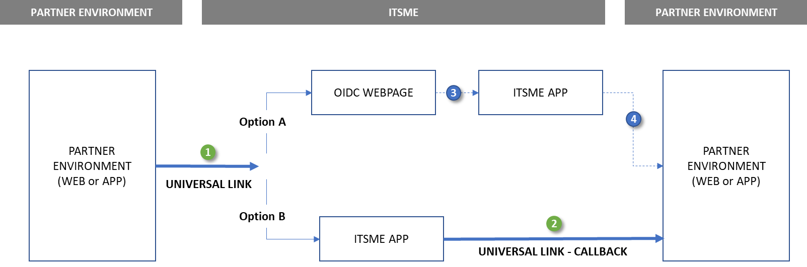

 ---
title: itsme(r) OpenID Connect documentation
 language_tabs: # must be one of https://git.io/vQNgJ
- json: JSON
- http: HTTP
---
# 1. Introduction
itsme is an identity checking system allowing Service Providers to use verified identities – through 4 services – for authentication and authorization on their web desktop, mobile web and in-app mobile applications:
- Login
- Confirm
- Share ID
- Sign (coming soon)

The objective of this document is to provide all the information needed to integrate the Login and Share ID services using the [OpenID Connect Core 1.0 specifications](http://openid.net/specs/openid-connect-core-1_0.html).

  
<a name id="Onboarding"></a>
# 2. Creating Sandboc
 
Before your application can integrate the itsme(r) OpenID implementation, you must set up a project in the [itsme(r) B2B portal](https://brand.belgianmobileid.be/d/CX5YsAKEmVI7) to obtain credentials, set a redirect URI, and customize the branding information that the Users see on the user-consent screen (e.g.: WYSIWYS screen) in the itsme® app. 

Once your project is created, you will receive:
- Your Partner Code, which corresponds to the OpenID `client_id`
- Your Service Codes, which are the identifiers of your instances of itsme(r) services.

You can find below some attention points when setting up the project.

## 2.1. JWKSet URL and Certificate attention points

The JWKSet URLs are used by our BE for the decryption and signature verification of the JWTokens present in the OpenID Connect flow. Our BE must know which URL to contact.

<aside class="warning">
  <ul>
     <li>
       It must contain the root, the intermediate CA and the final public certifiate.
    </li>
    <li>
      You can specify only one JWKSet URL per environment.
    </li>
     <li>
       On the HTTPS protocol level, connections must be secured using trusted Root CA.
    </li>
     <li>
       In production, it is not possible the certificate is NOT self-signed (it can be self-signed in Sandbox)
    </li>
    <li>
      BMID is notified on time if the certificate or the URL is changed.
    </li>
     <li>
       There is no need for your client certificate. Currently the certificate is also used to protect the JWKSet and it is not directly linked to the SSL certificate.
    </li>
  </ul>
</aside>

<aside class="notice">You can find our own JWKSet URL in our [OpenID configuration file](https://merchant.itsme.be/oidc/.well-known/openid-configuration), in the field "jwks_uri"</aside>.

## 2.2. Redirect_URI attention points

Redirect URIs (to which the User will be redirected after authentication in the itsme App) need to be whitelisted by our F5.
<aside class="warning"> 
<ul>
    <li> Multiple URLs can be whitelisted per service (can include Universal Link for your App)</li>
    <li> Additional parameters are not allowed and entire redirect_uri must match </li>
  </ul>  </aside>

# 3. Integrating itsme(r) services

**itsme® Login** is based on the [Authorization Code Flow](http://openid.net/specs/openid-connect-core-1_0.html#CodeFlowAuth) of OpenID Connect 1.0. The Authorization Code Flow goes through the steps as defined in [OpenID Connect Core Authorization Code Flow Steps](http://openid.net/specs/openid-connect-core-1_0.html#CodeFlowSteps), depicted in the following  [diagram](https://www.draw.io/?lightbox=1&highlight=0000ff&edit=_blank&layers=1&nav=1&title=Untitled%20Diagram.html#R7Vxbd6o4FP41PtZFCAF87HVOH6bTNZ1Zc%2BaRQlRWkTiAtZ1fP4mEWxIrYhC1Yx9aNnFjvi%2F7mtgRvF18%2FJJ4y%2FmvJMDRyDSCjxG8G5kmoD%2F0F5N85hLb5YJZEgZ8UCV4Cf%2FFXGhw6SoMcNoYmBESZeGyKfRJHGM%2Fa8i8JCHr5rApiZpPXXozLAlefC%2BSpX%2BFQTbPpa7pVPIfOJzNiycDe5LfWXjFYD6TdO4FZF0TwfsRvE0IyfK%2FFh%2B3OGLgFbjk73vYcrf8YAmOszZv4Li%2Fe9GKz41%2FruyzmGxCVnGA2XgwgjfreZjhl6Xns7trSi%2BVzbNFxG9zdTjJ8MfWjwTKidIVgskCZ8knHcLf4HBo%2BNqA%2FHJdAQ0K9OY1kG0u8zi3s1JxNX36B0dAjQY8PTSGhMM6PTisAeFApweHPSActgTHnylOJEjo5LLmvNMsIW%2F4lkQkoZKYxHTkzTSMIkHkReEsppc%2BBYMqhjcMqpB64Wt%2BYxEGAXuMEuiKCoOpJ3HG4wiAerAHoIk9krG3FNCbGqB3JOjDLF1gKrpeLr8PA3A4BtytDNx4%2FtsVjoPvQ4Pl7qQBGD3xMJF4eMHJe%2BgzJp4T8k7zROqSjEcG3JTB8m1YsQdkpbDLr0IlNZFrlopXgAZeOi9jZ40QERwKQPL5kyE3RsXl342YigMpfxdgowWDl8xwMWc1kjWokAKpQpbgyMvC9%2BYTVfDxJzyTkH6WKo7AJlG2GJxTskp8zN9Vz%2BVFRWZTURmgCkX5lCVFGzbLabcjuEXd0J3gtiQOxRgUGIOizbRlTFQkUa%2BRsRa1zdAmmcPGobFlM7WGJB3pMlNkNxVN%2BuO8RQE3NOd1ftGQ%2FDq6%2BHWcY%2FFb0FnjF4w32U6YhV7GciDPz0ISb0CkGNK35lnqySdBpqYKwRJCoiFnQWZfWZCiYWCOr1fZ%2FIkKf8f%2FrHCanQEVmloVSMhHgSVTUWYsuqmAsie0xvcbnGidMGcAmsbTavF6Fg0MXa1FJDAyUTAC%2B2JEbh9JyNcgXzJ3uXkcuhmhOybBSUifynC9I0k2JzMSe9FzJe1lERc2zSErK51GVSUjZulATO76nFw0r2dwtitH%2BJz180%2Fh4LFCfLFwWpJOljjesBc8hFFBNb2qh9Uti2Afor8kENh62BLrYgAmY9SNLzG3U6jSSNl%2BtfElUSbhrMvAAOqTsBZlUo0BMYi%2Fkiwji5w0gdSG8604dbXyyCEzxtBGkyZq%2FbhNUDxm7wbVLkVbOK0UFQPJdJrig3mX83M4vgvTZeQxXB8Dinw4pVTzEurFTzCl9fvkh2LxpMrYnZ7yQyQbJWK1bcXP2qNVbjxjZKiJOQebNVAvJmpanWOlaKQKVcc1UySbqc1Wwm%2BMr7Kjodz53HMFvEbEf%2Bsrxrr9ZEVS7tm192y67ZxxFwYHqVyocZW3a2Xhxlu2ZVToSY%2Bkgga5O4k%2F4kaEvrXQW0GD5J3zr8z2ROp%2BKNb9qlaJguey33jQQRsgQeaM6YSnJFlQMQ1%2Bm0zFi9J8mrWcpR9%2FWLM4w2yaHDDQ4TZXNzB7t4Fp8qwQNjnuvKuHhH1YCNy%2BrMmWY6PLYuMToZnrZxEVDTJl6evK93GaHroojpkmHZoViUR0LUfFbQRJkUZGz9I%2Fin1R2LIvKsaZTu5RPgMkIda939JY5wy5B28RRmyaP3D0jpm5KHISdl0UeyMTGpuXquJrlor1od2t5kjNVNEmxPyxa3NOUqTPuIpitbZUJs2isnSS26r9y%2FWWUPSWXbNJsUSRFGkk1JQIBWD8BzUpVhpu22MdvCzkQF3RfElyk5qyGdGqrM7ZzC5Fx%2B0GOHJfCMBxfvLceIyn5H%2FeG3QhsQLpyruk6Mi8y5kuMGuWni5JnMonW07YXZc9QKAnHot22vn80i5FRyZebh4BSzL4M6ZfWwu4mYIjeMB26U5VR14DF1EUlZHzCIdFnP2KosGPfjqD9lF1HgwZw9pLqIrdydiuvSZOK6PqYDCuXOicocEgxWnNvgzG3e98%2FCWf2kBiV6Zr4Scp0rjAFWUA2rOUv9iNe7FdiYot1PricRWGpOWbkYp8zWDMVCeftyRrF8uHePQZOgq%2FpvqatpZT6L5jTbDtADidIs%2FGVwqCvvJ0fuSlaeh%2F7c9qCQEcNfdggaV3Q2jYI6TS9rv4Hbuum0TlV%2BoO9pX0svr%2FIfnw6r%2BwwPv%2FAA%3D%3D),
  
 

## 3.1. Checking itsme® OpenID Configuration
The OpenID Connect protocol requires the use of multiple endpoints for authenticating users, and for requesting resources including tokens, user information and public keys.
 
To simplify implementations and increase flexibility, OpenID Connect allows the use of a "Discovery document", a JSON document found at well-known location containing key-value pairs which provide details about the OpenID Connect provider's configuration including, 
- URIs of the authorization, 
- token, 
- userinfo, 
- supported claims 
- [JWKSet](#jwks) URL. 

The Discovery document for itsme® service may be retrieved from: https://merchant.itsme.be/oidc/.well-known/openid-configuration .

<aside class="warning">There is one deprecated endpoint which is not documented in the Discovery document, and is used today by over 50% of our Apps. Please find details in section <a href="#AuthNRequest">Authentication Request Specifications</a></aside>

Field  names and meanings in this document are defined in [OpenID Connect Discovery 1.0](https://openid.net/specs/openid-connect-discovery-1_0.html).

## 3.2. Forming an authentication request
<a name="AuthNRequest"></a>

The Authorization Endpoint performs the authentication of the user. The first step is forming an HTTPS request to the Authorization Endpoint with the appropriate URI parameters. Please note the use of HTTPS rather than HTTP in all the steps of this process; HTTP connections are refused. Crafting the Authentication Request works as per the OpenID Connect specification [Authentication Request](http://openid.net/specs/openid-connect-core-1_0.html#AuthRequest) and [Authorization Endpoint](http://openid.net/specs/openid-connect-core-1_0.html#AuthorizationEndpoint).

You should retrieve the base URI from the [Discovery document](https://merchant.itsme.be/oidc/.well-known/openid-configuration) using the key **authorization_endpoint**. The following discussion assumes the endpoint is `https://merchant.itsme.be/oidc/authorize`.

This base URI is the address of our OpenID webpage, but this base URI is a valid Universal/App Link. As a result, if the itsme App is present on the same device as your front-end interface, the user will be automatically redirected to the itsme app (option B) without going through our OpenID webpage (option A), improving the user experience since in option A user will have to open the itsme App manually:



As suggested by this diagram, you can provide us a valid Universal/App Link as the redirect URI in order to improve the user experience as well. This redirect URI needs to be whitelisted on our end, as specified in the [Integration Prerequisites](#Onboarding) section.

<aside class="warning">The base URI available in the Discovery document will only be caught by recent versions of itsme Apps. As from 30/05/2018, more than 50% of the itsme Apps on the market will not catch this universal link. For these Apps, the flow will be functional but not optimal. The deprecated endpoint used by these Apps is https://mobileapp.sixdots.be/mobile/authorize</aside>


<aside class="warning">We strongly recommend to use only the HTTP `GET` method, since `POST` method will not be authorized when triggering the itsme App through the Universal Link mechanism. If you still opt for usage of the HTTP `POST` method, the request parameters must be serialized using <a href="http://openid.net/specs/openid-connect-core-1_0.html#FormSerialization">Form Serialization.</a></aside>

Please check the following table for request parameters,

```http--inline
 HTTP/1.1
 GET /authorize?response_type=code
 &scope=openid%20profile%20email%20service%3Aclient.registration
 &client_id=s6BhdRkqt3
 &state=af0ifjsldkj
 &redirect_uri=https%3A%2F%2Fclient.example.org%2Fcb HTTP/1.1
 Host: server.itsme.be
 ```

Parameter | Required | Specification
:-------- | :-------| :----- 
**client_id** | Required |This is your client identifier at the OpenID Provider. MUST be the Partner Code you obtained from BMID as part of the [integration prerequisites](#Onboarding).
**response_type** | Required | Used to indicate an authorization code flow. MUST be `code`. 
**scope** | Required | Used to specify the scope of the requested authorization in OAuth, as well as pre-defined sets of claims (see [Scope](#scope)). MUST contain at least `openid` or an HTTP ERROR `not_implemented` will be returned. As a BMID extension of the OpenID standard specification, MUST also includes the target service in the form `service:<SERVICE_CODE>` as provided by BMID during the [integration prerequisites](#Onboarding) (see <a name="ServiceCode"></a>[Service Code Concept](#ServiceCode) for further information).   ***Note**: Requested data will only be provided based on your current accesses. These accesses are specified as part of the [integration prerequisites](#Onboarding).* `offline_access` value will yield an error.
**redirect_uri** | Required | MUST be the HTTPS endpoint on your server that will receive the Authentication Response from **itsme(r)**. This value MUST match one of the values provided to BMID during [integration prerequisites](#Onboarding). ***Note**: the Partner can define different **redirect_uri** specific to each Service.*
**state** | An appropriate value is strongly RECOMMENDED. | No syntactic requirement on this parameter. Purpose is to serve as a reference for your transaction, to trace it through the different steps of the authentication. Should include the value of the anti-forgery unique session token, as well as any other information needed to recover the context when the user returns to your application. To use it for troubleshooting purposes, it is up to you to ensure the unicity of the `state` value.
**nonce** | An appropriate value is strongly RECOMMENDED.  | Value set by your end that you can use as a replay protection. No syntactic requirement on this parameter. Should be a random value with hig entropy. The purpose is to prevent id token to be displaced by an attacker by sending a valid id token from a different request in order to trick user visiting another website. See [note about nonce in OpenID specs](http://openid.net/specs/openid-connect-core-1_0.html#NonceNotes) for more information.
**login_hint** | Optional. Supported, though NOT RECOMMENDED. Usage of claim value `phone_number` in an encrypted `request` object is recommended in order to avoid disclosure of phone number of the end user on the user agent |  Hint to the Authorization Server about the login identifier the End-User might use to log in. Only phone numbers are supported as `login_hint`. Format is : `<countrycode>+<phonenumber>`. E.g. `login_hint=32+123456789`. `login_hint` with invalid syntax will be ignored.
**display** | Optional | An ASCII string value for specifying how the authorization server displays the authentication and consent user interface pages. MUST be `page` if provided. Other values will yield an HTTP ERROR `not_implemented`.
**prompt** | Optional | MUST be `consent` if provided. By giving 'consent' as value, the authorization server prompts the user for consent before returning information to the client. Offline access to data is not supported by BMID on purpose.
**ui_locales** | Optional | Can be used to specify the language to be used by the Open ID login page. Supported values are: {“fr”, “nl”, “en”, “de”}. Any other value will be ignored.
**max_age** | Optional. Supported but not used. | Specifies the allowable elapsed time in seconds since the last time the End-User was actively authenticated by the OP. If the elapsed time is greater than this value, the OP MUST attempt to actively re-authenticate the End-User. BMID does not maintain a session mechanism on purpose, an active authentication is thus always required.
<a name id="acrvalues">**acr_values**</a> | Optional. Supported, though NOT RECOMMENDED. Usage of `acr` parameter in the `request` object is recommended over this parameter as it will be signed in the JWT token |These values are used to specify the level of authentication the RP requires from the OP. BMID imposes more strict security rules on advanced level as for basic. Two values are supported `tag:itsmetag:sixdots.be,2016-06:acr_basic`: Basic level will let the User to choose either fingerprint usage (if Device is compatible) or PIN, `tag:itsmetag:sixdots.be,2016-06:acr_advanced`: Advanced level will force the User to use PIN. *When multiple values are provided only the most constraining will be used (advanced > basic). If not provided basic level will be used.* As there is no such idea of an existing session on itsme(r) Core, even if the `acr_values` is requested as a voluntarily claim, the `acr` value returned will always be the more constraining method in the `acr_values` list, or the authentication will fail.
**claims** | Optional. Supported, though NOT RECOMMENDED. Usage of claims parameter in the request object is recommended over this parameter as it will be signed in the JWT token, and the returned data will be encrypted. | MAY include claims for end user data. See [User Data](#Data) for more information.
**request** | Optional | See [Passing Request Parameters as JWTs](#JWTRequest)
**response_mode** | Unsupported | MUST not be used. Any supplied value will be ignored.|
**id\_token\_hint** | Unsupported | Ignored if provided.
**claims_locales** | Unsupported | None are supported.|
**request_uri** | Unsupported | Not supported (yet)|
**registration** | Unsupported | Not supported. The client registration process is manual. Please consult [integration prerequisites](#Onboarding).

<a name="AuthNResponse"></a>
## 3.3. Capturing an Authorization Code
If the User is successfully authenticated and authorizes access to the data requested, itsme® will return an authorisation code to your server component. This is achieved by returning an Authentication Response, which is a HTTP 302 redirect request to the `redirect_uri` specified previously in the authentication request.
 
```http--inline
 HTTP/1.1 302 Found
 Location: https://client.example.org/cb?
 code=SplxlOBeZQQYbYS6WxSbIA&
 state=af0ifjsldkj
 ```
As such, the Authentication Response will return the following parameters:

Parameter | Provided | Description
:--:| :--:|:--
**code** | Always | Authorization code to later provide to the token endpoint. This code has a lifetime of 3 minutes.
**state** |  | The exact value received from the client, if the parameter was present in the Authentication Request.
 
### Handling Authentication Error Response

In some cases, it is possible that the user is not redirected automatically to your environment. A typical example is when the user stays inactive in our front-end (whether in the itsme App or in our OpenID webpage). It would also be the case if the `redirect_uri` is malformed.

There are also cases where the user will be redirected to your environment with an [Authentication Error Response]((http://openid.net/specs/openid-connect-core-1_0.html#AuthError)). As for a successful response this is achieved by returning a HTTPS 302 redirect request to the redirection_uri specified in the authentication request. Following parameters could be added to the query component of the redirection_uri:

```http--inline
HTTP/1.1 302 Found
Location: https://client.example.org/cb?
error=invalid_request
&error_description=Unsupported%20response_type%20value
&state=af0ifjsldkj 
```

Parameter |	Required	| Description
:--|:--|:--
error	| Required |	Error type.
error_description |	Optional	| Indicating the nature of the error

The following errors can be triggered by itsme(r):

Error | Description
:-- |:--
`interaction_required`  | The Authorization Server requires End-User interaction of some form to proceed.
`invalid_request_object` | The request parameter contains an invalid Request Object.
`request_uri_not_supported` | does not support use of the request_uri parameter.
`registration_not_supported` | does not support use of the registration parameter.

## 3.4. Supporting Universal Links and App Links mechanism
[Universal links](https://developer.apple.com/ios/universal-links/) and [App links](https://developer.android.com/studio/write/app-link-indexing) are standard web links (http://mydomain.com) that point to both a web page and a piece of content inside an app. When a Universal Link is opened, the app OS checks to see if any installed app is registered for that domain. If so, the app is launched immediately without ever loading the web page. If not, the web URL is loaded into the webbrowser.
An App link is the Android version of the Universal link.
How do Universal Links work in iOS and Android ? Before Universal Links, the primary mechanism to open up an app when it was installed was by trying to redirect to an app’s URI scheme  in the web browser. But there was no way to check if the app was installed or not. This meant that developers would try to call the URI scheme 100% of the time, in the off chance that the app was installed, then fallback gracefully to the App Store or Google Play Store when not by using a timer.
iOS Universal Links and Android App Links were intended to fix this. Instead of opening up the web browser first when a link is clicked, the OS will check if a Universal Link has been registered (a file should be there in the domain which contains the bundle id of the app and the paths the app should open) for the domain associated with the link, then check if the corresponding app is installed. If the app is currently installed, it will be opened. If it’s not, the web browser will open and the HTTPS link will load.
Functionally, it will allow you to have a single link that will either open your desktop web application, your mobile app or your mobile site on the User’s device.
The specifications for the implementation of Universal links and App links can be found in the Appendix.


## <a name="tokenEndpoint"></a> 3.5. Exchanging the authorisation code 
Once your server component has received an [authorization code](#AuthNResponse), your server can exchange it for an Access Token and an ID token.

<aside class="notice">There are many types of tokens mentioned in the OpenID specification. You might also read in the OpenID specification about the Refresh Token, but we don't support them (we don't implement any session mechanism).</aside>

Your server makes this exchange by sending an HTTPS POST request to the Token Endpoint, called [Token Request](http://openid.net/specs/openid-connect-core-1_0.html#TokenRequest). The Token Endpoint URL is available in our [OpenID discovery document](https://merchant.itsme.be/oidc/.well-known/openid-configuration), at key "token_endpoint". In this discussion, we assume this URL is 'https://merchant.itsme.be/oidc/token'.

<aside class="warning">We only support `private_key_jwt` for client authentication.</aside>

<aside class="success"> The header Content-Type : application/x-www-form-urlencoded MUST be present.</aside>

<aside class="notice"> In order to communicate with Token Endpoint, TLS MUST be implemented. See http://openid.net/specs/openid-connect-core-1_0.html#TLSRequirements 16.17 for more information on using TLS. </aside>

```http--inline
GET /oidc/authorization?response_type=code
&client_id=yourpartnercode
&yourredirecturl
&scope=openid+service%3Ayourservicecode+profile+
&claims={"userinfo":{" tag:sixdots.be,2016-06:claim_nationality": null},
"id_token":{"auth_time": {"essential": true},"acr_values
{"value":["tag:sixdots.be,2016-06:acr_advanced"]
}}}&state=anystate&nonce=anonce&prompt=login&max_age=1
```
The Token Request must include the following parameters in the POST body:

Parameter | Required | Comment
--| -- |--
**grant_type** | Required | Must be `authorization_code`
**code** | Required | The code value provided in the Authentication Response
**redirect_uri** | Required | The **redirect_uri** used in the Authentication Request. This is the URL to which you want the user to be redirected after the authorization is complete.
**client_assertion** | Required | Must be a valid JWT complying with the `private_key_jwt` client authentication method as defined in [Section 9](http://openid.net/specs/openid-connect-core-1_0.html#ClientAuthentication) of the OpenID specification. This JWT must be signed.
**client\_assertion\_type** | Required | Must be `urn:ietf:params:oauth:client-assertion-type:jwt-bearer` 

### `client_assertion` 
According to the `private_key_jwt` client authentication method, the **client assertion** JWT must contain the following properties:

Property | Comment
-- |--
**iss** | The issuer of the `private_key_jwt` (the client ID). MUST be the Partner Code you obtained from BMID during on-boarding process (this information is in the onboarding file provided by BMID).
**sub** | The subject of the `private_key_jwt` (the client ID). MUST be the Partner Code you obtained from BMID during on-boarding process (this information is in the on boarding file provided by BMID). 
**aud** | Must be the token endpoint URL
**jti** | A unique identifier for the token, which can be used to prevent reuse of the token. These tokens MUST only be used once.
**exp** | Expiration time on or after which the ID Token MUST NOT be accepted for processing.

<a name="TokenResponse"></a>
## 3.6. Managing Token Response
### Handling a successful Token Response
If the Token Request validation is successful we will return an HTTP 200 OK response including id and access tokens as in the example aside:

```http--inline
HTTP/1.1 200 OK
  Content-Type: application/json
  Cache-Control: no-store
  Pragma: no-cache

  {
   "access_token": "SlAV32hkKG",
   "token_type": "Bearer",
   "expires_in": 3600,
   "id_token": "eyJhbGciOiJSUzI1NiIsImtpZCI6IjFlOWdkazcifQ.ewogImlzc
     yI6ICJodHRwOi8vc2VydmVyLmV4YW1wbGUuY29tIiwKICJzdWIiOiAiMjQ4Mjg5
     NzYxMDAxIiwKICJhdWQiOiAiczZCaGRSa3F0MyIsCiAibm9uY2UiOiAibi0wUzZ
     fV3pBMk1qIiwKICJleHAiOiAxMzExMjgxOTcwLAogImlhdCI6IDEzMTEyODA5Nz
     AKfQ.ggW8hZ1EuVLuxNuuIJKX_V8a_OMXzR0EHR9R6jgdqrOOF4daGU96Sr_P6q
     Jp6IcmD3HP99Obi1PRs-cwh3LO-p146waJ8IhehcwL7F09JdijmBqkvPeB2T9CJ
     NqeGpe-gccMg4vfKjkM8FcGvnzZUN4_KSP0aAp1tOJ1zZwgjxqGByKHiOtX7Tpd
     QyHE5lcMiKPXfEIQILVq0pc_E2DzL7emopWoaoZTF_m0_N0YzFC6g6EJbOEoRoS
     K5hoDalrcvRYLSrQAZZKflyuVCyixEoV9GfNQC3_osjzw2PAithfubEEBLuVVk4
     XUVrWOLrLl0nx7RkKU8NXNHq-rvKMzqg"
  }

```
The Token Response follow these specifications:

Parameter | Provided | Comment
-- | -- | --
**[`access_token`](#actoken)** | Always | Will be provided. 
**[`token_type`](http://openid.net/specs/openid-connect-core-1_0.html#TokenResponse)** | Always | Will be `Bearer`
**[`id_token`](#idtoken)** | Always | The id_token corresponding to the Authentication Request (signed and  encrypted). 
**[`at_hash`](http://openid.net/specs/openid-connect-core-1_0.html#CodeIDToken)** | Never | Current version of itsme(r) Core does not produce the `at_hash` value
**[`refresh_token`](#rfshtoken)** | Never | Won't be provided as **itsme(r)** only maintains short-lived session to enforce re-authentication.

The ID Token follow these specifications:

Parameter |	Required |	Description
:-- | :-- | :--
iss	| Required |	Identifier of the issuer of the ID Token.
sub |	Required	| An identifier for the User (e.g.: UserCode), unique among all itsme® accounts and never reused. Use sub within in the application as the unique-identifier key for the user.
aud	| Required |	Audience of the ID Token. Will include the `client_id`
exp	| Required |	Expiration time on or after which the ID Token MUST NOT be accepted for processing.
iat |	Required	| The time the ID token was issued, represented in Unix time (integer seconds)
auth_time | Will always be provided | Time when the End-User authentication occurred. Its value is a JSON number representing the number of seconds from 1970-01-01T0:0:0Z as measured in UTC until the date/time.
nonce | Provided if present in Authentication Request | String value used to associate a Client session with an ID Token, and to mitigate replay attacks. The value is passed through unmodified from the Authentication Request to the ID Token. If present in the ID Token, Clients MUST verify that the nonce Claim Value is equal to the value of the nonce parameter sent in the Authentication Request. If present in the Authentication Request, Authorization Servers MUST include a nonce Claim in the ID Token with the Claim Value being the nonce value sent in the Authentication Request.
acr | Will always be provided | Possible values: `tag:sixdots.be,2016-06:acr_basic` and `tag:sixdots.be,2016-06:acr_advanced`
amr | Will never be provided |
azp | Will never be provided |

### Handling Token Error Response 
If the Token Request is invalid or unauthorized an HTTP 400 response will be returned as in the example:
```http--inline
HTTP/1.1 400 Bad Request
Content-Type: application/json
Cache-Control: no-store
Pragma: no-cache
{
  "error": "invalid_request"
}
```
The response will contain an error parameter and optionally `error_description` and `error_uri` parameters. The error_uri parameter may be used by implementations to specify a human-readable web page with information about the error, used to provide the client developer with additional information about the error.

## 3.7. Matching users databases
The first time a user uses itsme(r) at your side, you will receive an unknown userCode from the [Token Response](#TokenResponse) for him. You then have to determine whether or not you already have an account at your own side for this user, and this section briefly describes our recommendation on the topic, in order to optimize the user experience.

### Automatic match

The smoothest user experience comes when you can guarantee a high level of verification of a set of data we have in common with you. If you ask for user data that you own on your side as well, you can match these data to automatically associate the userCode to the correct user account on your side, and offer a seamless journey to the user

Of course, it is possible that the user has no account yet at your side. You may use in that case  the [user data](#Data) we provide you to facilitate the account creation and automatically link it to the userCode.

The following picture illustrates both cases:


For this to be safe, though, the following must be verified between you and us:
- On both sides, the data used to match the accounts must uniquely identify the user
- On both sides, the lifecycle of the data used to match the accounts must be understood and must guarantee a constant control of the user identified through this data

<aside class="success">If you intend to implement this, please contact us so that we can verify the consistency of this use case together.</aside>


### Manual match

If there is no data that can be used on both sides to match the accounts automatically, simply authenticate the user with your usual credentials when you receive a new userCode from the [Token Response](#TokenResponse). You then have to associate this userCode to the account on your side.

Of course, it is possible that the user has no account yet at your side. You may use in that case  the [user data](#Data) we provide you to facilitate the account creation and automatically link it to the userCode.

The following picture illustrates both cases:


<a name="Data"></a>
## 3.8 Obtain User Data
### What is a claim?

The concept of claim is about declaring something you expect as return from the OP. When it comes to end user data, you have to use claims in order to declare the end user data you will need for your business before the authentication. This is a privacy-oriented way of getting data.

Technically, you have to declare the claims in the Authorization Request in the way described in the section [Declaring Claims](#decClaim).

Claims will come as name/value pairs packaged in a JSON object that contain information about a user, as well as meta-information about the OIDC service. The official definition from the spec is a [“piece of information asserted about an Entity.”](http://openid.net/specs/openid-connect-core-1_0.html#Terminology)

<aside class="notice"> We do not support Aggregated and Distributed Claims due to all the data we expose come from our own database.</aside>

Claims that are directly asserted by the OpenID Provider.
Normal Claims are represented as members in a JSON object. The Claim Name is the member name and the Claim Value is the member value.

The following is a non-normative response containing Normal Claims:
 ```http--inline
  {
   "name": "Jane Doe",
   "given_name": "Jane",
   "family_name": "Doe",
   "email": "janedoe@example.com",
   "picture": "https://www.itsme.be/uploads/media/57da4dee8c5d2/logo-itsme-badge.svg?production-f26c079"
  } 
  ```
In current version and in contradiction to the OpenID Connect specification, **itsme(r)** considers all claims requested via scope as **Essential** (see [Individual Claim Request](http://openid.net/specs/openid-connect-core-1_0.html#IndividualClaimsRequests)). **Voluntary** claims are thus supported, but are used as **Essential**.

In practice, it means the User may not opt out the sharing of specific Data; the User must either gives his consent for the sharing of all Data or refuse the request as a whole. However, in a future version **itsme(r)**  will make the difference between **Essential** and **Voluntary** claims. You should thus already request claims according to your business case.

### <a name id="decClaim"></a> Declaring Claims
You can declare Claims in two ways:
- With `scope` values
- With `claims` parameter

In each case, the claims need to be declared in the Authorization Request.
#### <a name id="scope"></a> Using `scope` values
Scopes are space-separated lists of identifiers used to specify what access privileges are being requested. 

Scopes can be used to request that specific sets of information available as Claim Values in User Info Token. 

Using this method, you will always receive Claims from the UserInfo Endpoint.

<aside class="success">Any claim requested by using the scope value can only be obtained from the User Info endpoint.</aside>

The following scope values are supported and allow access to predefined sets of Identity Data:

Scope Value | Associated Claims
--|--
profile | given_name, family_name, gender, birthdate,  locale
email|email, email_verified
phone| phone_number, phone_number_verified
address|address, with subfields,<br>street_address (newline separator \n)<br> locality <br> postal_code <br> country

#### Using `claims` parameter

Some specific data cannot be requested by using scope values. They have to be requested in the claims as request parameter of the Authentication Request. Using this [method](https://openid.net/specs/openid-connect-core-1_0.html#ClaimsParameter) of requesting claims, you need to specify the endpoint you want the claims to come from. ( see example for different specifying endpoints [4.2.2.1. Set of Request Parameter Adapted to itsme(r)](#example-endpoint))

Here are these custom claims defined by BMID:

Data | Claim | Comment 
-- | -- | --
Nationality | **`tag:itsmetag:sixdots.be,2016-06:claim_nationality`** |
Place of Birth - city | **`tag:itsmetag:sixdots.be,2016-06:claim_city_of_birth`** |
Place of Birth - country | **`tag:itsmetag:sixdots.be,2016-06:claim_country_of_birth`** | 
E-ID Metadata  | **`tag:itsmetag:sixdots.be,2016-06:claim_eid`** |  See [eID Metadata](#eidMetadata)
Passport Number | **`tag:sixdots.be,2017-05:claim_passport_sn`** | Simple string containing the user’s Passport Serial Number. 
Device | **`tag:sixdots.be,2017-05:claim_device`** | See [Device Claim](#deviceClaim)
Transaction Info| **`tag:sixdots.be,2017-05:claim_transaction_info`** |See [Transaction Info](#transactionInfo)
E-ID Picture | **`tag:sixdots.be,2017-05:2017-05:claim_photo`**|
 
 
As per specified by OpenID Connect, there is a set of [standard claims](https://openid.net/specs/openid-connect-core-1_0.html#StandardClaims), or user attributes. They are intended to supply the client app with consented user details such as email, name and picture, upon request.  They can be requested to be returned either in the UserInfo Response, per [Section 5.3.2](https://openid.net/specs/openid-connect-core-1_0.html#UserInfoResponse), or in the ID Token, per [Section 2](https://openid.net/specs/openid-connect-core-1_0.html#IDToken).

The following table lists the supported standard "claim" values, 

Member  |Type  |Description
:--|:--|:--
name |string|Subject - Concatenation  for the End-User at the Issuer.
given_name|string|  Given name(s) or first name(s) of the End-User. Note that in some cultures, people can have multiple given names; all can be present, with the names being separated by space characters.
family_name|string|Surname(s) or last name(s) of the End-User. Note that in some cultures, people can have multiple family names or no family name; all can be present, with the names being separated by space characters.
profile|string|URL of the End-User's profile page. The contents of this Web page SHOULD be about the End-User.
email|string|End-User's preferred e-mail address. Its value MUST conform to the [RFC 5322](https://openid.net/specs/openid-connect-core-1_0.html#RFC5322) [RFC5322] addr-spec syntax. The RP MUST NOT rely upon this value being unique, as discussed in [Section 5.7](https://openid.net/specs/openid-connect-core-1_0.html#ClaimStability).
email_verified|boolean|True if the End-User's e-mail address has been verified; otherwise false. When this Claim Value is true, this means that the OP took affirmative steps to ensure that this e-mail address was controlled by the End-User at the time the verification was performed. The means by which an e-mail address is verified is context-specific, and dependent upon the trust framework or contractual agreements within which the parties are operating.
gender|string|End-User's gender. Values defined by this specification are female and male. Other values MAY be used when neither of the defined values are applicable.
birthdate|string|End-User's birthday, represented as an [ISO 8601:2004](https://openid.net/specs/openid-connect-core-1_0.html#ISO8601-2004) [ISO8601‑2004] YYYY-MM-DD format. The year MAY be 0000, indicating that it is omitted. To represent only the year, YYYY format is allowed. Note that depending on the underlying platform's date related function, providing just year can result in varying month and day, so the implementers need to take this factor into account to correctly process the dates.
locale|string|End-User's locale, represented as a [BCP47](https://openid.net/specs/openid-connect-core-1_0.html#RFC5646) [RFC5646] language tag. This is typically an [ISO 639-1 Alpha-2](https://openid.net/specs/openid-connect-core-1_0.html#ISO639-1) [ISO639‑1] language code in lowercase and an [ISO 3166-1 Alpha-2](https://openid.net/specs/openid-connect-core-1_0.html#ISO3166-1)[ISO3166‑1] country code in uppercase, separated by a dash. For example, en-US or fr-CA. As a compatibility note, some implementations have used an underscore as the separator rather than a dash, for example, en_US; Relying Parties MAY choose to accept this locale syntax as well.
phone_number|string|  End-User's preferred telephone number.  [E.164](https://openid.net/specs/openid-connect-core-1_0.html#E.164)  [E.164] is RECOMMENDED as the format of this Claim.If the phone number contains an extension, it is RECOMMENDED that the extension be represented using the  [RFC 3966](https://openid.net/specs/openid-connect-core-1_0.html#RFC3966)  [RFC3966] extension syntax.
phone_number_verified |boolean (**always true**)|True if the End-User's phone number has been verified; otherwise false. When this Claim Value is true, this means that the OP took affirmative steps to ensure that this phone number was controlled by the End-User at the time the verification was performed. The means by which a phone number is verified is context-specific, and dependent upon the trust framework or contractual agreements within which the parties are operating. When true, the phone_number Claim MUST be in E.164 format and any extensions MUST be represented in RFC 3966 format.
address|JSON object|End-User's preferred postal address. The value of the address member is a JSON [[RFC4627]](https://openid.net/specs/openid-connect-core-1_0.html#RFC4627) structure containing some or all of the members defined in [Section 5.1.1](https://openid.net/specs/openid-connect-core-1_0.html#AddressClaim).
 
#### <a name id="deviceClaim"></a> Device Claim 
This claim is the information about the end user device. 

Claim value: **`tag:sixdots.be,2017-05:claim_device`**

This will return you a JSON object with the following keys: (only keys with cardinality [1…1] will be always available)

```json--inline
{ 
  "os": "ANDROID",
  "appName": "itsme app",
  "appRelease": "1.17.13",
  "deviceLabel": "myDevice",
  "debugEnabled": false,
  "deviceId": "deviceId",
  "osRelease": "Android 4.4.2",
  "manufacturer": "samsung",
  "hasSimEnabled": true,
  "deviceLockLevel": "touchID",
  "smsEnabled": true,
  "rooted": false,
  "imei": "12345678901234567",
  "deviceModel": "S8",
  "msisdn": "0412123123",
  "sdkRelease": "1.17.12" 
 }
```
Key | Value
:-- | :--
`os` | the device operating system (possible values: `ANDROID`, `IOS`)   
`appName` | the application name.   
`appRelease` | the application current release.   
`deviceLabel` | the name of the device.   
`debugEnabled` | if debug mode is activated.   
`deviceId` | (regexp =“[a-f0-9]{33}”) the device identifier.   
`osRelease` | Version of the OS running on your Device.  
`manufacturer` | Brand of the device manufacturer (‘Apple’ on iOS, device specific on Android).
`hasSimEnabled` | Whether there is a SIM in the Device. Is always `true`, as long as BMID keeps forbidding installing itsme on a tablet. 
`deviceLockLevel` | The type of action to be performed to unlock the Device. On iOS : TOUCH_ID, PASSCODE or NONE if User protected his Device with TouchID, PIN or nothing.   
`smsEnabled` | Can send SMS. On iOS, means it’s an iPhone.
`rooted` | Always `false` as long as BMID keeps forbidding using itsme on a jailbreaked/rooted device.   
`imei` | (regexp = “[0-9]{15,17}”) the device IMEI value.
`deviceModel` | Model of the Device, e.g. `SAMSUNG GALAXY A5`
`msisdn` | the user’s phone number.  
`sdkRelease` | SDK release

#### <a name id="eidMetadata"></a> Eid Metadata Claim 

Claim value: **`tag:itsmetag:sixdots.be,2016-06:claim_eid`**

This claim is Belgian Electronic ID card information encoded in JSON, with the following keys:

Key | Value
:-- | :--
`eid` | the electronic ID card serial number
`issuance_locality` | the issuance locality
`validity_from` | eID card validity “from” date
`validity_to` | eID card validity “to” date
`certificate_validity` |the certificate validity
`read_date` | the data extraction date. Each date is encoded using ISO 8601 UTC (timezone) date format. Example of ISO 8601 UTC date: 2017-04-01T19:43:37+0000

#### <a name id="transactionInfo"></a> Transaction Info Claim
Claim value: **`tag:sixdots.be,2017-05:claim_transaction_info`**
Information available in the context of the current transaction.

```http--inline
{ "securityLevel": "SIM\\\_AND\\\_SOFT", "bindLevel": "SIM\\\_AND\\\_SOFT", "mcc": 206 }
```

A JSON object with the following keys:

Key | Value
:-- | :--
`securityLevel` | (supported values: `SOFT_ONLY`, `SIM_ONLY`, `SIM_AND_SOFT`) Security level used during transaction
`bindLevel` | (supported values: `SOFT_ONLY`, `SIM_ONLY`, `SIM_AND_SOFT`) tells if the user account is bound to a SIM or not, at the time the transaction occurred
`mcc` | the Mobile Country Code. An Integer (three digits) representing the mobile network country. 


### Getting Data

As per the [OpenID Connect specification](http://openid.net/specs/openid-connect-core-1_0.html#UserInfoRequest), depending on how you declared claims in the Authentication Request, you will receive the user data from:
- The UserInfo Endpoint
- The Token Endpoint, in the ID Token
<aside class="success">Should there be 2 calls to itsme(r) for this schedule, one for Token Request & one for UserInfo Request?   
Indeed, You need to perform two Back-End to Back-End calls:  
- The Token Request  
- The UserInfo Request  
On top of this, the Authorization Request (AuthN Request in the schedule) consists of an HTTP redirection to the OpenID webpage of BMID. The content of this HTTP request is to be crafted by your system, it is actually a third call from your side to BMID, this one being Front-End to Back-End.</aside>

#### UserInfo Endpoint
As per the [OpenID Connect specification](http://openid.net/specs/openid-connect-core-1_0.html#UserInfoRequest).

If you declared claims with `scope` values or if you declared claims in the `userinfo` part of the `claims` parameter in the `request` object, you will receive the end user data from the UserInfo Endpoint.

The UserInfo endpoint returns previously consented user profile information to the client app. For that a valid access token is required.

Your server sends the User Info Request using either HTTP  `GET`  or HTTP  `POST` method. The Access Token obtained from an Authentication Request must be sent as a Bearer Token. It is recommended that the request use the HTTP  `GET`method and the Access Token be sent the using the  `Authorization`  header field. The HTTP request is sent to the User Info endpoint, which you should retrieve from the  [Discovery document](https://merchant.itsme.be/oidc/.well-known/openid-configuration)  using the key  **userinfo_endpoint**.

The content type of the response will be `application/JWT`. The response will be signed and encrypted. 

The UserInfo endpoint can be accessed only with a valid **access_token** and for a very limited duration after end user authentication. There must be _less than 3 minutes_ between the creation of the user action to be confirmed by the end user on his mobile device, and the access to the User Info Endpoint.
The Access Token will define the list of Data that will be provided back to the client. In order to request specific claims, you can  [use scopes](https://stackedit.io/app#stClaims)  in the Authentication Request and/or  [use the claims parameter](https://stackedit.io/app#Claims-Request)  of the  request Object.

##### User info Request Specification
As per specified [OIDC UserInfo Request](http://openid.net/specs/openid-connect-core-1_0.html#UserInfoRequest).

The Client sends the UserInfo Request using either HTTP  GET  or HTTP  POST. The Access Token obtained from an OpenID Connect Authentication Request MUST be sent as a Bearer Token, per Section 2 of  [OAuth 2.0 Bearer Token Usage](http://openid.net/specs/openid-connect-core-1_0.html#RFC6750)  [RFC6750].

<aside class="success">It is recommended that using HTTP GET request method and  sending Access Token by using the Authorization header field.</aside>

```http--inline
GET /userinfo HTTP/1.1 
Host: server.example.com 
Authorization: Bearer SlAV32hkKG
``` 
|Parameter  | Comment
|--|--|
| acr | Possible values: <br>`tag:sixdots.be,2016-06:acr_basic`<br>`tag:sixdots.be,2016-06:acr_advanced` |
| amr |Won’t be provided  |
| azp| Won’t be provided |
|auth_time | Will always be provided

##### User info Response Specification
The content type of the response will be `application/jwt`. The response will be signed and encrypted by BMID using the signing and encryption certificate exposed. The itsme Back-End replies with the Identity Data that were requested in the Authorization Request.
<aside class="success">What is the lay-out of the Identity Data that BMID obtain in the Userinfo Response? They are the same as on the eID card </aside>
<aside class="success">What format does the certificate need to be?
It needs to be in ZIP file, X509 format (cer or crt). Pem file is not supported.  </aside>

##### User info Response Example
(Not encrypted nor signed)
 
```http--inline
 HTTP/1.1 200 OK
 Content-Type: application/json
 
 {
    "sub": "248289761001",
    "name": "Jane Doe",
    "email": "janedoe@example.com"
 }
 ```
##### User info Errors
When an error condition occurs, the UserInfo Endpoint returns an Error Response as defined in Section 3 of  [OAuth 2.0 Bearer Token Usage RFC6750](https://tools.ietf.org/html/rfc6750)   (HTTP errors unrelated to RFC 6750 are returned to the User Agent using the appropriate HTTP status code.)

The following is a non-normative example of a UserInfo Error Response:
```http--inline
  HTTP/1.1 401 Unauthorized
  WWW-Authenticate: error="invalid_token",
    error_description="The Access Token expired"
 ```

#### Token Endpoint
As per specified by OIDC, when using the authorization code flow to obtain an Access Token and an ID Token, you will send a token request to token endpoint to have a token response.
If you declared  claims in the `id_Token` part of the `claims` parameter in the `request` object,  you will receive the end user data from the Token Endpoint.

##### Token Endpoint Specs
To get further information about token types, token request/response specifications please proceed with [3.2 Token Endpoint](#tokenEndpoint).

##### Example of Id Token Containing “claims”
*Will be provided soon*

 
# 4. Appendixes
## 4.1. <a name="JWTRequest"></a>Passing Request Parameters as JWTs

As per specified by OIDC [here](https://openid.net/specs/openid-connect-core-1_0.html#JWTRequests), Authorization Request parameters to enable Authentication Requests to be signed and optionally encrypted are explained.
 
The Request Object is a JWT token as defined in [RFC 7519](https://tools.ietf.org/html/rfc7519), which contains at least the following properties:

Property | Required | Comment
-- | -- | --
**iss** | Required | Specifies the issuing authority. Issuer of the id_tokenIssuer. Must be the `client_id`
**aud** | Required | Audience. MUST be the Token Endpoint URL
 
 Example of claim request before base64url encoding, signing and encryption. In this example, the partner is using the login service.
 
```json--inline
 {
 	// JWT Registered claims (https://tools.ietf.org/html/rfc7519#section-4.1)
 	iss: "s6BhdRkqt3",
 	aud: "https://server.itsme.be",
 	// OIDC parameters, must reflect the values of the HTTP parameters
 	client_id: "s6BhdRkqt3",
 	response_type: "code",
 	redirect_uri: "https://client.example.org/cb",
 	scope: "openid email service:PARTNER_LOGIN",
 	state: "af0ifjsldkj",
 	nonce: "n-0S6_WzA2Mj",
 	claims:
 	{
 		userinfo: {
 		    "tag:itsmetag:sixdots.be,2016-06:claim_nationality": null,
 		},
 		id_token: {
 			auth_time: {"essential": true},
 			acr: {"value": \["tag:itsmetag:sixdots.be,2016-06:acr_advanced"\] 		
 		}
 	}
 }
 ```
 
## 4.2. Requests Signing and Encryption 
Encryption algorithm used: RSA SHA-256
 
Supported algorithms and encryption methods for:
- ID Token
-- Encryption Method (enc): A128CBC-HS256
-- Encryption Algorithm (alg): RSA-OAEP
-- Signing Algorithm (alg): RS256
- User Info
-- Encryption Method (enc): A128CBC-HS256
-- Encryption Algorithm (alg): RSA-OAEP
-- Signing Algorithm (alg):  RS256
- Request Object
-- Encryption Method (enc): A128CBC-HS256
-- Encryption Algorithm (alg): RSA-OAEP
-- Signing Algorithm (alg): RS256
 
Offline access is not supported. 
 
Dynamic client registration is not allowed.
 
itsme(r) exposes its signing and encryption keys on a public endpoint (JWKSet) 
https://merchant.itsme.be/oidc/jwkSet
 
It is expected that you will also expose their signing and encryption keys in such a way. The location of your JWKSet must be configured by an  administrator of BMID during your on-boarding. The exposed endpoint must be HTTPS.


## 4.3. Universal Links on iOS
Integration is going to be pretty straightforward, all details can be found in below steps (as documented on [Universal Links official documentation](https://developer.apple.com/ios/universal-links/)):
1. Register your app at developer.apple.com
2. Enable ‘Associated Domains’ on your app identifier
3. Enable ‘Associated Domain’ on in your Xcode project
4. Add the proper domain entitlement and make sure the entitlements file is included at build: Xcode will do it automatically by itself.
5. Create the ‘apple-app-site-association’ file (AASA). The AASA file contains a JSON object with a list of apps and the URL paths on the domain that should be included or excluded as Universal Links. Here is a sample AASA file:

```
{
  "applinks": {
    "apps": [],
    "details": [
      {
        "appID": “JHGFJHHYX.com.facebook.ios",
        "paths": [
          "*"
        ]
      }
    ]
  }
} 
```
The JSON object will contain 

Parameter |	Description
:-- | :--
appID	| Built by combining your app’s Team ID (it should be retrieved from https://developer.apple.com/account/#/membership/) and the Bundle Identifier. In the example attached, JHGFJHHYX is the Team ID and com.facebook.ios is the Bundle ID.
paths	| Array of strings that specify which paths are included or excluded from association. Note: these strings are case sensitive and that query strings and fragment identifiers are ignored.

6. Upload the ‘apple-app-site-association’ file to your HTTPS web server for the redirection URI communicated in the Authentication request. The file can be placed at the root of your server or in the .well-known subdirectory.

<aside class="notice"> While hosting the AASA file, please ensure that the AASA file:
<ul>
  <li>
    is served over HTTPS.
  </li>
  <li>
    uses application/json MIME type.
  </li>
  <li>
    don’t append .json to the apple-app-site-association filename.
  </li>
  <li>
    has a size not exceeding 128 Kb (requirement in iOS 9.3.1 onwards)
  </li>
</aside>

7. Check if the AASA file is valid and is accessible by using the [following link](https://branch.io/resources/aasa-validator/#resultsbox)
8. Add an entitlement to all redirect URI that the your app need to supports. In Xcode, open the Associated Domains section in the Capabilities tab and add an entry for each Redirect URI that your app supports, prefixed with `applinks`.
<aside class="notice">Apple doc says to limit this list to no more than about 20 to 30 domains<aside>

To match all subdomains of an associated redirect URI, you can specify a wildcard by prefixing `*.` before the beginning of a specific Redirect URI (the period is required). Redirect URI matching is based on the longest substring in the `applinks` entries. For example, if you specify the entries `applinks:*.mywebsite.com` and `applinks:*.users.mywebsite.com`, matching for the redirect URI `emily.users.mywebsite.com` is performed against the longer `*.users.mywebsite.com` entry. Note that an entry for `*.mywebsite.com` does not match `mywebsite.com` because of the period after the asterisk. To enable matching for both `*.mywebsite.com` and `mywebsite.com`, you need to provide a separate `applinks` entry for each.
  
9. Update the app delegate to respond appropriately when it receives the `NSUserActivity` object. After all above steps are completed perfectly, when the User click a universal link, the app will open up and the method `application:continueUserActivity:restorationHandler` will get called in `Appdelegate`. When iOS launches the the app after a User taps a universal link, you receive an `NSUserActivity` object with an `activityType` value of `NSUserActivityTypeBrowsingWeb`. The activity object’s `webpageURL` property contains the redirect URI that the user is accessing. The webpage URL property always contains an HTTPS URL, and you can use `NSURLComponents` APIs to manipulate the components of the URL.

```http--inline
func application(_ application: UIApplication, continue userActivity: NSUserActivity, restorationHandler: @escaping ([Any]?) -> Void) -> Bool {
    print("Continue User Activity called: ")
    if userActivity.activityType == NSUserActivityTypeBrowsingWeb {
        let url = userActivity.webpageURL!
        print(url.absoluteString)
        //handle url and open whatever page you want to open.
    }
    return true
}
```

For getting the URL parameters, use the following function:

```http--inline
//playground code..
var str = “https://google.com/contents/someotherpath?category=series&contentid=1562167825"
let url = URL(string: str)
func queryParameters(from url: URL) -> [String: String] {
let urlComponents = URLComponents(url: url, resolvingAgainstBaseURL: false)
var queryParams = [String: String]()
for queryItem: URLQueryItem in (urlComponents?.queryItems)! {
if queryItem.value == nil {
continue
}
queryParams[queryItem.name] = queryItem.value
}
return queryParams
}
// print the url parameters dictionary
print(queryParameters(from: url!))

//It will print [“category”: “series”, “contentid”: “1562167825”]
```

Also if you want to check if the app had opened by clicking a universal link or not in the `didFinishLaunchingWithOptions` method:

```http--inline
func application(_ application: UIApplication, didFinishLaunchingWithOptions launchOptions: [UIApplicationLaunchOptionsKey : Any]? = nil) -> Bool {
 var isUniversalLinkClick: Bool = false
 if launchOptions[UIApplicationLaunchOptionsUserActivityDictionaryKey] {
 let activityDictionary = launchOptions[UIApplicationLaunchOptionsUserActivityDictionaryKey] as? [AnyHashable: Any] ?? [AnyHashable: Any]()
 let activity = activityDictionary[“UIApplicationLaunchOptionsUserActivityKey”] as? NSUserActivity ?? NSUserActivity()
 if activity != nil {
 isUniversalLinkClick = true
 }
 }
 if isUniversalLinkClick {
 // app opened via clicking a universal link.
 } else {
 // set the initial viewcontroller
 }
 return true
}
```
## 4.4. App Links on Android

The App Links Assistant in Android Studio can help you create intent filters in your manifest and map existing URLs from your website to activities in your app. Follow below steps to configure the App links (as documented on [App Links official documentation](https://developer.android.com/studio/write/app-link-indexing)):

1. Add the intent filters to your manifest. Go through the your manifest and select Tools > App Links Assistant. Click Open URL Mapping Editor and then click Add  at the bottom of the URL Mapping list to add a new URL mapping.
2. Add details for the new URL mapping:
  * Entering your redirect URI in the `host` field 
  * Add a `path`, `pathPrefix`, or `pathPattern` for the redirect URIs you want to map. For example, if you have a recipe-sharing app, with all the recipes available in the same activity, and your corresponding website's recipes are all in the same `/recipe directory`, use `pathPrefix` and enter `/recipe`. This way, the redirect URI http://www.recipe-app.com/recipe/grilled-potato-salad maps to the activity you select in the following step.
  * Select the Activity the redirect URI should take users to.
  * Click OK.
3. The App Links Assistant adds intent filters based on your URL mapping to the `AndroidManifest.xml` file, and highlights it in the `Preview` field. If the you would like to make any changes, click Open `AndroidManifest.xml` to edit the intent filter.

<aside class="notice">To support more links without updating the app, you should define a URL mapping that supports redirect URIs that he will add in the future. </aside>

4. To verify the URL mapping works properly, enter a URL in the Check URL Mapping field and click Check Mapping. If it's working correctly, the success message shows that the URL entered maps to the activity you selected.
5. Handle incoming links. Once you have verified that the URL mapping is working correctly, you MUST add the logic to handle the intent he created.
  * Click Select Activity from the App Links Assistant.
  * Select an activity from the list and click Insert Code.
The App Links Assistant adds code to the activity's Java file, similar to the following:
```
// ATTENTION: This was auto-generated to handle app links.
Intent appLinkIntent = getIntent();
String appLinkAction = appLinkIntent.getAction();
Uri appLinkData = appLinkIntent.getData();
```
However, this code isn't complete on its own. You MUST now take an action based on the URI in <appLinkData>, such as display the corresponding content. For example, for the recipe-sharing app, the code might look like the following sample:

```
  protected void onCreate(Bundle savedInstanceState) {
  super.onCreate(savedInstanceState);
  ...
  handleIntent(getIntent());
}

protected void onNewIntent(Intent intent) {
  super.onNewIntent(intent);
  handleIntent(intent);
}

private void handleIntent(Intent intent) {
    String appLinkAction = intent.getAction();
    Uri appLinkData = intent.getData();
    if (Intent.ACTION_VIEW.equals(appLinkAction) && appLinkData != null){
        String recipeId = appLinkData.getLastPathSegment();
        Uri appData = Uri.parse("content://com.recipe_app/recipe/").buildUpon()
            .appendPath(recipeId).build();
        showRecipe(appData);
    }
}
```

6. Associate the app with the redirect URI. After setting up URL support for your app, the App Links Assistant generates a Digital Asset Links file you can use to associate his website with your app. As an alternative to using the Digital Asset Links file, you can associate your site and app in Search Console. To associate the app and the website using the App Links Assistant, click Open the Digital Asset Links File Generator from the App Links Assistant and follow these steps:
  * Enter your Site domain and Application ID.
  * To include support in your Digital Asset Links file for Smart Lock for Passwords, select Support sharing credentials between the app and the website and enter your site's login URL. This adds the following string to your Digital Asset Links file declaring that your app and website share sign-in credentials: `delegate_permission/common.get_login_creds`.
  * Specify the signing config or select a keystore file. Make sure to select the right config or keystore file for either the release build or debug build of your app. If you want to set up his production build, use the release config. If you want to test his build, use the debug config.
  * Click `Generate Digital Asset Links` file.
  * Once Android Studio generates the file, click `Save file` to download it.
  * Upload the `assetlinks.json` file to redirect URI site, with read-access for everyone, at `https://<yoursite>/.well-known/assetlinks.json`.

<aside class="notice">The system verifies the Digital Asset Links file via the encrypted HTTPS protocol. Make sure that the assetlinks.json file is accessible over an HTTPS connection, regardless of whether your app's intent filter includes https</aside>
  * Click <Link and Verify> to confirm that you've uploaded the correct Digital Asset Links file to the correct location.


<!--stackedit_data:
eyJoaXN0b3J5IjpbLTkyNDAxNDExNywxMzc4MTU5MDU1LDUzND
U2NDc3MywxMjA0MDY2Mzc4LDE1NDM0MTExNTQsLTY2OTk5OTIw
OCwtNjIyMTI5MDMsOTY2MzYwNjQ3LDE4MTEzNzMzNSwxNDEwNz
g5MTA1LC0xNzU4NzQ0MjcsMTAxNTE2Mzg2NywtMTM3MDU4NjIy
OSw0NDUxMzg3MDgsMjEyNzY5MTEzNCwtMTc1NDgwMjQ0OSwxNz
M0NDE5NDM0LC0xNjMzNDM5ODEzLC0xNDU0ODMxMTg4LC01Nzk3
MDE3MjNdfQ==
-->
<!--stackedit_data:
eyJoaXN0b3J5IjpbLTc5MTgxMTAwNl19
-->
<!--stackedit_data:
eyJoaXN0b3J5IjpbNjI1ODcyNDI4LC00MTYxMTEyNTIsNTQ2ND
UzOTUzLDEwNzcxNDQzMzUsOTkwODM1NDc1LDMxMzEwMjAzNyw0
MzI5MzIxOTYsLTE1MTQwMDM3MTgsMzc1MDYwMDEzLC0xOTE3NT
g5MjExLDIxMTQ4ODY5NCwtMTM3MjIzNjE0NSw3OTI2NzA0NzMs
LTE5NDA2NDc3MjIsMTM3OTI2ODA2OSw2NTYwOTIwMjgsLTIwOT
MzNTI3OTgsMTM1NzAwMDU4Nl19
-->
